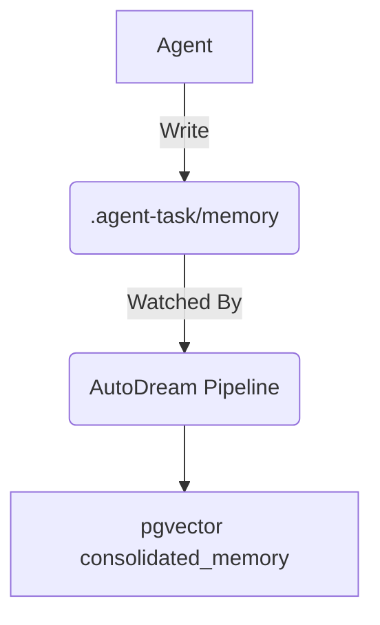

# Title: Implement KAIROS Hybrid OS Orchestration v4

## Problem Statement
The OHC swarm requires a distributed Shared Task List, a realtime Teammate Mesh, and an AutoDream vector memory pipeline for true autonomous orchestration in both cloud-native and standalone deployments.

## Research Report
We analyzed the orchestration needs across deployment modes.

| Feature | Cloud-Native Mode | Standalone Mode |
|---|---|---|
| Shared Task List | PostgreSQL (FOR UPDATE SKIP LOCKED) | SQLite (Transactions & Mutex) |
| Teammate Mesh | Redis Pub/Sub (`rueidis`) | In-Memory Go Channels |
| AutoDream Vector | pgvector | Local Blob Embeddings |

## Design Doc
1. **Shared Task List**: `shared_tasks_v4` schema using `VARCHAR PRIMARY KEY` for compatibility.
2. **Teammate Mesh**: `MeshEvent` structs with `agent_id`, `action`, `status` across `mesh:tasks` and `mesh:coordination`.
3. **AutoDream**: Polls memory directory, embeds content, stores in `consolidated_memory`.

## Implementation Prompt
Hello Implementer!
1. Add the `shared_tasks_v4` migration in `srcs/server/db/migrations/`.
2. Implement the `SharedTaskOrchestrator` to interface with this database.
3. Implement the Teammate Mesh APIs for Redis/Memory transports.
4. Build the AutoDream pipeline to sync `.agent-task/memory/` into `consolidated_memory`.

## Priority
P0

## Estimated Scope
Large

