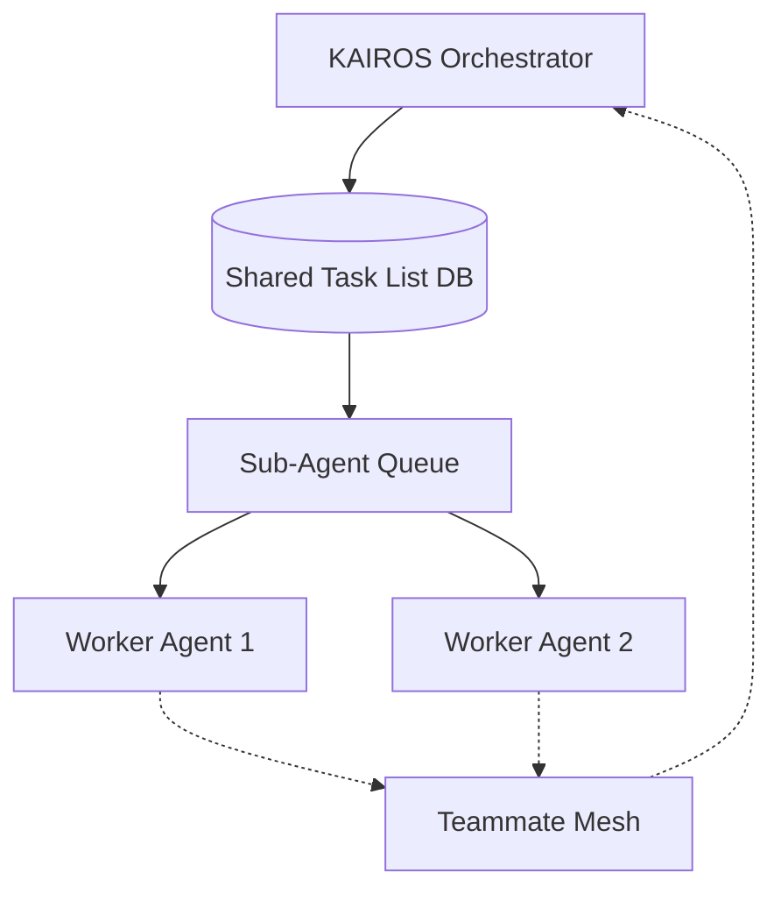

**Title**: Implement KAIROS Orchestrator: Shared Task List, Teammate Mesh, and AutoDream Pipeline

**Problem Statement**:
The OHC Hybrid Agentic OS requires an autonomous, resilient backbone to seamlessly decompose massive human goals into isolated, parallel agentic workflows. We need to implement the actual database schemas and Go code for the "Shared Task List" (Phase 1), "Sub-Agent Orchestration Queue" (Phase 2), "Teammate Mesh APIs" (Phase 2), and "autoDream data pipelines" (Phase 3) supporting both Cloud-Native (PostgreSQL/Redis) and Standalone (SQLite) modes.

**Research Report**:
- **Shared Task List**: Acts as the "Brain", breaking down large tasks into a Directed Acyclic Graph (DAG).
  - PostgreSQL uses `SELECT FOR UPDATE SKIP LOCKED` for Cloud-Native concurrency.
  - SQLite uses explicit transactions/mutexes (`sync.Mutex` / `datetime('now')`) for Standalone execution.
- **Teammate Mesh APIs**:
  - Exposes `POST /api/mesh/broadcast` and `GET /api/mesh/subscribe`.
  - Payloads are OHC-SIP compliant (JSON with `agent_id`, `action`, `status`).
- **AutoDream Pipelines**:
  - Consolidates episodic agent memory into a durable vector store (`autodream_memories` or `consolidated_memory`) using `VECTOR(1536)` embeddings.
  - Background `AutoDreamWorker` converts episodic memory into long-term embeddings using Minimax APIs.

| Feature | Cloud-Native Mode | Standalone Desktop Mode |
|---|---|---|
| **Shared Task List** | PostgreSQL (`FOR UPDATE SKIP LOCKED`) | SQLite (Transactions + `sync.Mutex`) |
| **Teammate Mesh** | Redis Pub/Sub (`rueidis`) | In-memory Go Channels (`MemoryMeshTransport`) |
| **AutoDream Memory** | `pgvector` (`VECTOR(1536)`) | SQLite (JSON/Text Fallback) |

**Design Doc**:
See `design/KAIROS_AI_OS_HYBRID_ARCHITECTURE.md` for the complete architectural diagram, structural vision, and premium aesthetic tokens.

**Implementation Prompt**:
Hello Implementer,
Your task is to implement the KAIROS Orchestration backend features:
1. Create the `shared_tasks_dag` and `task_dependencies_dag` table migrations in both PostgreSQL and SQLite. Use `VARCHAR` and `TEXT` for SQLite compatibility. Ensure proper index usage.
2. Implement the Teammate Mesh transport interface accommodating both `RedisMeshTransport` and `MemoryMeshTransport`.
3. Build the `AutoDreamWorker` that reads `.agent-task/memory/*.yml` files, generates embeddings via Minimax, and stores them in `consolidated_memory`. Ensure proper background daemon lifecycle management.
4. Instrument critical paths with OpenTelemetry metrics.
5. Ensure 100% test coverage and ensure all tests pass (`bazelisk test //...`). Add SQLite-specific tests setting `DATABASE_URL` to `sqlite://:memory:`.

**Priority**: P0
**Estimated Scope**: Large
