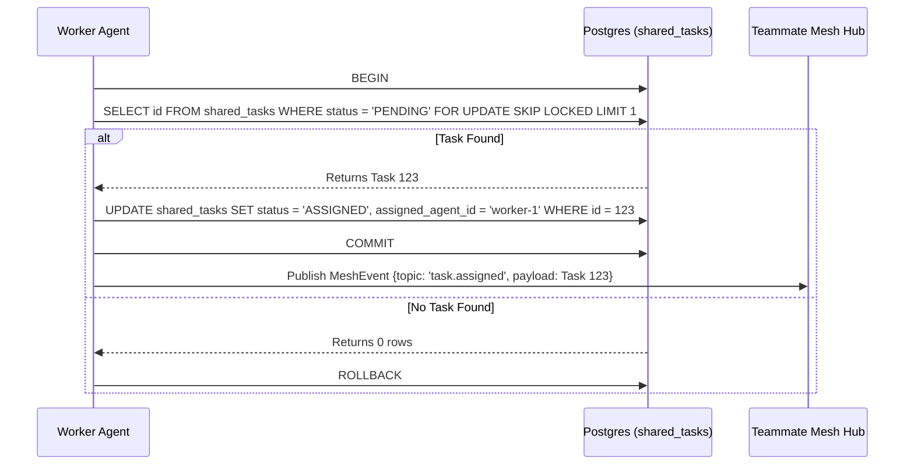

# Problem Statement
We need to orchestrate a vast swarm of AI agents. A Shared Task List needs to be decomposed and architected.

# Research Report
KAIROS mode needs sequence diagrams, database schemas, and state machine tracking for distributed teammate mesh.

# Design Doc
<div markdown="1" style="backdrop-filter: blur(20px) saturate(200%); font-family: 'Outfit', 'Inter', sans-serif; background: rgba(255, 255, 255, 0.03); color: #fff; padding: 20px; border-radius: 12px; border: 1px solid rgba(255, 255, 255, 0.1);">

# OHC KAIROS Orchestration: Shared Task List & Teammate Mesh

## 1. Phase 1: Shared Task List Decomposition

The Shared Task List relies on database-backed state machines to prevent race conditions during task claiming.

### Database Schema (PostgreSQL):
```sql
CREATE TABLE IF NOT EXISTS shared_tasks (
    id UUID PRIMARY KEY DEFAULT gen_random_uuid(),
    organization_id VARCHAR NOT NULL,
    title VARCHAR NOT NULL,
    description TEXT,
    status VARCHAR NOT NULL DEFAULT 'PENDING',
    agent_id VARCHAR,
    priority VARCHAR NOT NULL DEFAULT 'P2',
    payload JSONB,
    parent_plan_id TEXT,
    dependencies JSONB NOT NULL DEFAULT '[]',
    locked_until TIMESTAMP,
    created_at TIMESTAMP WITH TIME ZONE DEFAULT CURRENT_TIMESTAMP,
    updated_at TIMESTAMP WITH TIME ZONE DEFAULT CURRENT_TIMESTAMP
);
```

### Shared Task Claiming Workflow


## 2. Phase 2: Teammate Mesh APIs

The Teammate Mesh ensures agents coordinate without delays.

- **Endpoint:** `POST /api/mesh/v2/broadcast`
  Broadcasts a state machine event over structured channels.

```json
{
  "channel": "mesh:tasks",
  "event_type": "TASK_TRANSITION",
  "data": {
    "task_id": "task_12345",
    "previous_state": "PENDING",
    "new_state": "IN_PROGRESS"
  }
}
```
</div>

# Implementation Prompt
Hello Implementer,

Please implement the Shared Task List and Teammate Mesh APIs according to the Design Doc.

1. **Database Schema:** Create a Goose migration file in `srcs/server/db/migrations/` to add the `shared_tasks` table. Update `srcs/server/db/BUILD.bazel`.
2. **Teammate Mesh API:** Implement the `POST /api/mesh/v2/broadcast` endpoint in `srcs/server/orchestration/mesh.go`.
3. **Tests:** Write unit tests for the API and the database schema in `srcs/server/orchestration/mesh_test.go`.
