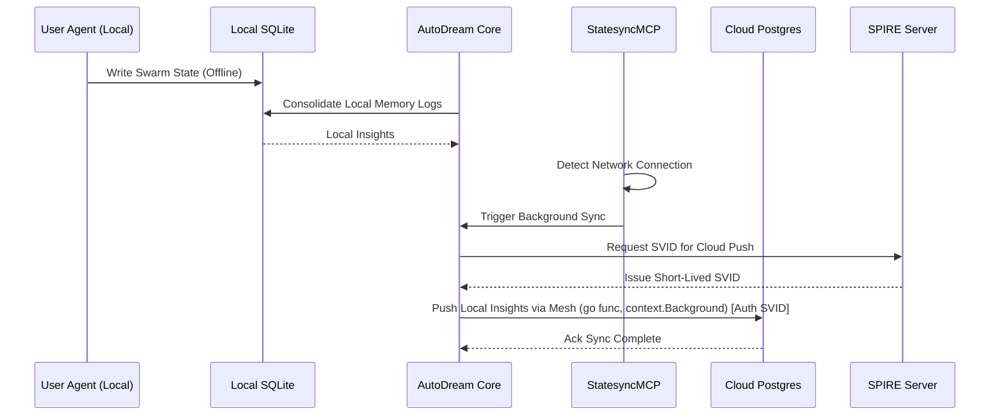

# Disruption Audit: Capitalizing on OHC-HA vs Claude/OpenClaw

## Problem Statement
Current "Agentic OS" platforms (Claude Code, OpenClaw, Replit Agent) are strictly tethered to cloud-native paradigms, isolating users from powerful local-first performance and privacy. They entirely lack the "Hybrid Architecture" (local SQLite + cloud Postgres synchronization) that allows graceful degradation, complete data sovereignty, and standalone edge autonomy. Furthermore, current platforms lack built-in SPIFFE/SPIRE integration for secure zero-trust identity between swarms.

## Research Report
The global market for Agentic Operating Systems is bifurcating between rigid enterprise cloud solutions and isolated local hobbyist scripts.

| Feature / Architecture | Claude Code | OpenClaw | Replit Agent | OHC Hybrid (Proposed) |
| :--- | :--- | :--- | :--- | :--- |
| **Local Offline Mode** | No | No (Requires Heavy Docker) | No | **Yes (SQLite)** |
| **Cloud Synchronization** | N/A | Manual | Native Cloud Only | **Autonomous (Postgres)** |
| **Agent Identity / Auth** | API Keys | API Keys | Platform Specific | **SPIFFE / SPIRE native** |
| **Tool Extensibility** | MCP | Custom | Platform Specific | **MCP + OHC-Mesh** |

**The Hybrid Gap (The "Blue Ocean")**: No platform allows a user to run an intelligent swarm *locally* using a lightweight SQLite backend that transparently and autonomously synchronizes long-term durable state to a shared Postgres Cloud environment when connectivity is restored, all while securing agent workloads via SPIFFE/SPIRE workload identity.

## Design Doc
**Feature Concept**: OHC Hybrid Synchronization Protocol (OHC-HSP) with Zero-Trust Workload Identity

*Architecture Update*:
*   **Edge Mode (Local)**: The user runs OHC Desktop. All active swarms, tasks, and embeddings are routed to `modernc.org/sqlite` with `pgvector` compatible JSON serialized fallback.
*   **AutoDream Core Update**: Expand the AutoDream consolidation pipeline. When offline, AutoDream consolidates local SQLite logs. When online, the `StatesyncMCP` tool dynamically triggers a background worker `go func()` (using `context.Background()`) that pushes locally consolidated memory to the Cloud Postgres.
*   **Zero-Downtime Swarm**: Ensure `queue.NewSQLiteTaskQueue` seamlessly pauses processing and yields to the Cloud Queue when connection is detected, allowing cloud agents to pick up heavy workloads.
*   **Agent Identity (SPIFFE/SPIRE)**: Implement strict zero-trust identities. During the `go func()` synchronization over the Teammate Mesh, the connection must dynamically authenticate using temporary SVIDs provided by a local SPIRE agent.

## Implementation Prompt
**Task: Implement Seamless Hybrid AutoDream State Synchronization with SPIRE Auth**

Implement a robust synchronization mechanism that pushes locally consolidated AutoDream memories from SQLite to the OHC Cloud Postgres backend when network connectivity is established, secured by SPIFFE/SPIRE.

1.  Modify `srcs/server/sync/autodream_sync.go` to include a robust exponential backoff retry mechanism for the Cloud Postgres push.
2.  Update the `AutoDreamSyncEngine.Sync(ctx context.Context)` method. If `dbWrapper.IsSQLite()` is true, select newly consolidated memories (where `synced = false`), marshal them securely, and transmit them via the Teammate Mesh API (`srcs/server/orchestration/mesh/`).
3.  Ensure the Mesh broadcast is executed asynchronously in a `go func()` with `context.Background()` to prevent parent HTTP/RPC context cancellation from interrupting the sync.
4.  Before transmission in the goroutine, authenticate the Mesh connection by requesting a temporary SVID from the SPIRE workload API.
5.  Write comprehensive tests in `srcs/server/sync/autodream_sync_test.go` utilizing the `modernc.org/sqlite` in-memory provider. The tests must simulate an offline-to-online transition and verify the mesh broadcast is triggered with valid auth.
6.  Maintain >90% test coverage for the modified packages. You must verify using `bazelisk test //srcs/server/sync/...`.

