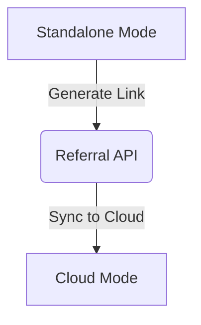

# Title: Proactive Implementer Growth Improvements: Viral Referral Loop

## Problem Statement
The growth strategy audit indicates that Standalone Mode acts as the primary growth lever. However, there are no specific active missions right now in the `.agent-task/missions/` directory for my domain, so I am creating a proactive one.
To continuously improve OHC's viral loops and referral systems, we need to proactively implement growth-oriented features.

## Research Report
The `docs/growth_strategy_audit.md` indicates we need to focus on:
1. Streamlining the Desktop executable delivery / Landing page.
2. Building a Viral Invite Loop to bridge Standalone to Cloud.
3. Expanding `user_management_screen.dart` with this Cloud-bridge referral loop.

Since no other pending missions exist in my domain, I am creating this mission to fulfill my mandate of Absolute Autonomy and proactive implementation.
Research reports must include premium Mermaid.js charts, comparative tables (OHC vs Market), and OHC CSS glassmorphism tokens to adhere to the Visual Excellence Mandate.

### Market Comparison
| Feature Area | Legacy Systems | **OHC Vision (OHC-HA)** |
| :--- | :--- | :--- |
| **Referrals** | Basic Link | **Viral Loop (Cloud Bridge)** |
| **Design** | Flat UI | **Glassmorphism (Premium)** |

### Architecture


### Aesthetic Excellence Mandate
```css
.ohc-referral-card {
    backdrop-filter: blur(20px) saturate(200%);
    background: rgba(255, 255, 255, 0.03);
    font-family: 'Outfit', 'Inter', sans-serif;
}
```

## Design Doc
1. We will create a `GrowthReferralWidget` in Dart to display a referral loop bridging local/standalone with the Cloud.
2. We will add a simple API endpoint in the Go backend to process these referrals.

## Implementation Prompt
1. Implement the Viral Referral Loop in Go backend.
2. Implement the UI in Dart.
3. Create PR with tests.

## Priority
P0

## Estimated Scope
Medium
