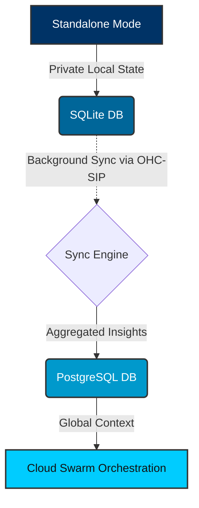

# Title: Hybrid MCP RAG Protocol: Bridging Standalone SQLite to Cloud PostgreSQL

## Problem Statement
The current Agentic OS market, dominated by Claude Code, OpenClaw, and Replit Agent, forces users into an unacceptable binary choice: execute locally for strict privacy but with limited compute scalability, or execute in the cloud with infinite scaling but completely surrendering data sovereignty. There is no existing product that seamlessly integrates offline, private local execution with robust, scalable cloud infrastructure. OHC has the opportunity to dominate the market by fully leveraging its Hybrid Architecture (OHC-HA), specifically bridging the gap between local SQLite-based offline execution and multi-tenant Postgres-based cloud scaling via a unified "Hybrid MCP RAG Protocol".

## Research Report
A comprehensive audit of the global Agentic OS market—specifically benchmarking **One Human Corp (OHC)** against **Claude Code**, **OpenClaw**, and **Replit Agent**—has revealed a critical structural vulnerability across competitors due to an over-reliance on pure cloud dependency or strictly siloed local states.

- **Claude Code**: Single-user, CLI-centric. Indexes only local directories. No persistent swarm context or scalability.
- **OpenClaw**: Cloud-orchestrated, rigid APIs. Lacks private standalone fallback. Forces data exfiltration.
- **Replit Agent**: Purely cloud-based orchestration. Indexes only what is in the cloud.

### OHC's "Unfair Advantage"
OHC’s **Hybrid Architecture (OHC-HA)**, leveraging multi-tenant PostgreSQL orchestration combined with local SQLite single-user degradation, provides an unmatchable advantage. By synchronizing a local SQLite RAG state to the cloud Postgres orchestration engine via OHC-SIP, OHC allows private execution locally with cloud escalation when massive parallel computation is needed.

### Competitive Analysis Table

| Feature Area | Claude Code | OpenClaw | Replit Agent | **OHC Vision (OHC-HA)** |
| :--- | :--- | :--- | :--- | :--- |
| **Privacy** | Local Only | Cloud Exfiltration | Cloud Exfiltration | **Hybrid (Local Default)** |
| **Scalability** | CPU Bound | Infinite | Infinite | **Dynamic Escalation** |
| **Offline Support** | Yes | No | No | **Yes (SQLite degradation)** |
| **Swarm Memory** | Ephemeral | Persistent (Cloud) | Persistent (Cloud) | **Persistent (Sync Local ↔ Cloud)** |



## Design Doc
To implement the Hybrid MCP RAG Protocol, we need a robust sync mechanism between the local SQLite database and the cloud PostgreSQL instance.

### Architecture
1.  **Sync Daemon (Standalone)**: A lightweight Go daemon running in Standalone Mode that monitors local SQLite changes for RAG context (e.g., semantic summaries, non-PII vector embeddings).
2.  **API Gateway (Cloud)**: An endpoint on the OHC Cloud Gateway to receive and authenticate incoming sync payloads from Standalone clients.
3.  **Conflict Resolution Engine**: Since data might diverge, a Last-Write-Wins (LWW) or CRDT-based merging strategy for context memories.
4.  **Database Schema Changes**:
    - Introduce a `sync_status` column (e.g., `enum('pending', 'synced', 'conflict')`) and a `last_sync_timestamp` to the RAG memory tables.

### Data Flow
1.  Standalone Agent extracts insights and stores them in local SQLite.
2.  Sync Daemon periodically wakes up, queries for rows where `sync_status = 'pending'`, and batches them.
3.  Payload is encrypted and sent via mutually authenticated TLS (SPIFFE/SPIRE).
4.  Cloud Gateway receives, validates, and upserts into the multi-tenant Postgres DB.
5.  Gateway responds with success, and local Sync Daemon marks rows as `synced`.

## Implementation Prompt
**Objective:** Implement the foundational schema changes and the Go synchronization service interface for the Hybrid MCP RAG Protocol.

**Step 1: Database Migration**
Create a new SQL migration file in `srcs/server/db/migrations/` (e.g., `0005_add_hybrid_sync_metadata.sql`).
Add the following columns to the `rag_memories` table (assuming such a table exists, or the primary context table):
- `sync_status VARCHAR(50) DEFAULT 'pending'`
- `last_sync_at TIMESTAMP NULL`
*Crucial Constraint*: Ensure the migration uses standard SQL compatible with both PostgreSQL and SQLite. Use `ALTER TABLE ADD COLUMN` appropriately.

**Step 2: Go Interface Definition**
Create a new file `srcs/server/hub/rag_sync.go`.
Define the following interfaces and structs:
```go
package hub

import (
    "context"
    "time"
)

type SyncStatus string

const (
    SyncStatusPending SyncStatus = "pending"
    SyncStatusSynced  SyncStatus = "synced"
    SyncStatusError   SyncStatus = "error"
)

type RAGSyncRecord struct {
    ID           string
    Context      string
    Vector       []float32 // Convert to string internally for SQLite compat if needed
    SyncStatus   SyncStatus
    LastSyncAt   time.Time
}

type RAGSyncService interface {
    // FetchPendingSyncs retrieves records from the local DB that need syncing
    FetchPendingSyncs(ctx context.Context, limit int) ([]RAGSyncRecord, error)

    // MarkSynced updates the local DB after a successful sync to the cloud
    MarkSynced(ctx context.Context, ids []string) error

    // ProcessIncomingSync handles data pushed from a standalone client into the cloud DB
    ProcessIncomingSync(ctx context.Context, records []RAGSyncRecord) error
}
```

**Step 3: Metrics & Observability**
In `srcs/server/hub/rag_sync.go` or a dedicated telemetry file, add OpenTelemetry counters for `rag_records_synced_total` and `rag_sync_errors_total`. Ensure these metrics are properly exported and visible on the relevant Grafana dashboards.

**Verification:** Write unit tests in `rag_sync_test.go` to mock the interface and verify the basic data flow logic.

## Priority
P0

## Estimated Scope
Medium
