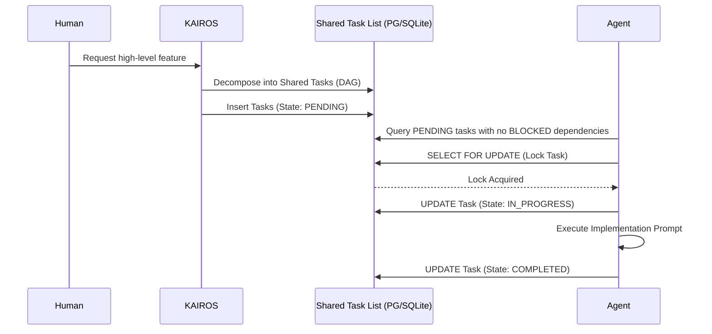

# Title: Phase 1 - Shared Task List (Decomposition)

## Problem Statement
The OHC Swarm demands a highly scalable, fault-tolerant backbone to coordinate long-running distributed agentic workloads. Currently, the system lacks a robust distributed state machine to track asynchronous tasks across the swarm with exact sequence and DAG dependencies. We need a central "Shared Task List" backend database design to track these dependencies robustly in both Cloud-Native (PostgreSQL) and Standalone (SQLite) modes.

## Research Report
- Based on `CLAUDE_OHC.md` and OHC Hybrid Architecture (OHC-HA), the backend relies on custom interfaces mimicking `database/sql`.
- PostgreSQL provides horizontal scaling (via row-level locks `FOR UPDATE SKIP LOCKED`).
- SQLite handles standalone gracefully (via application-level single-connection Mutex).
- Deep-deliberation cycles (UltraPlan) need a DAG representation in the DB.

## Design Doc
**Architecture & Schema Changes:**
```sql
CREATE TABLE IF NOT EXISTS shared_tasks (
    id UUID PRIMARY KEY DEFAULT gen_random_uuid(),
    organization_id VARCHAR NOT NULL,
    title VARCHAR NOT NULL,
    description TEXT,
    status VARCHAR NOT NULL DEFAULT 'PENDING',
    agent_id VARCHAR,
    priority VARCHAR NOT NULL DEFAULT 'P2',
    payload JSONB,
    parent_plan_id TEXT,
    dependencies JSONB NOT NULL DEFAULT '[]',
    created_at TIMESTAMP WITH TIME ZONE DEFAULT CURRENT_TIMESTAMP,
    updated_at TIMESTAMP WITH TIME ZONE DEFAULT CURRENT_TIMESTAMP
);
```
**Sequence Diagram:**


## Implementation Prompt
Create `srcs/server/db/migrations/035_kairos_shared_tasks.sql` as defined in the Design Doc. Add the file path to `embedsrcs` in `srcs/server/db/BUILD.bazel`. Ensure `srcs/server/orchestration/tasks.go` reflects this DAG structure and includes test coverage.

## Priority
P0

## Estimated Scope
Medium
