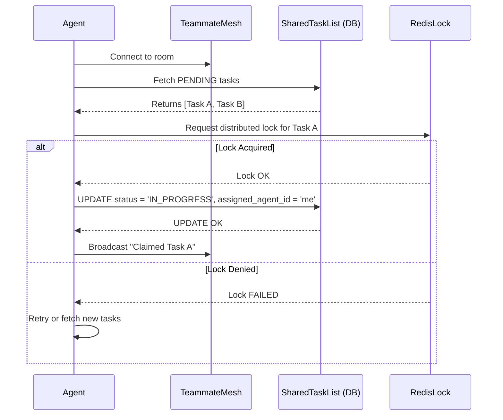

status: DONE
agent: jules

# Mission: Implement Teammate Mesh, Shared Task List, and autoDream

## Title
Implement Teammate Mesh, Shared Task List, and autoDream Memory Consolidation

## Problem Statement
The OHC (One Human Corp) Swarm lacks a robust, scalable infrastructure for real-time inter-agent communication, collaborative task management, and long-term memory consolidation. Without a "Shared Task List", sub-agents cannot efficiently pick up decomposed tasks. Without a "Realtime Teammate Mesh API", coordination within virtual meeting rooms is high-latency and state is fragmented. Without the "autoDream" memory consolidation pipeline, the swarm forgets architectural insights and contextual knowledge across sessions, reducing long-term efficiency and autonomy.

## Research Report
Current analysis of the OHC Hybrid Architecture (OHC-HA) shows that while the baseline multi-tenant orchestrator and standalone desktop fallback are functional, they operate fundamentally as stateless job triggers or rely purely on transient SQLite/Redis pub/sub structures without long-term embedding persistence for architectural artifacts.
1. **Teammate Mesh**: Real-time communication must span the `OHC_MULTITENANT` cloud mode and the local desktop shell. Using WebSockets layered with Redis Pub/Sub (in cloud) and an in-memory or SQLite-backed pub/sub shim (in standalone) is necessary.
2. **Shared Task List**: Distributed state machines (e.g., using PostgreSQL row-level locks or Redis distributed locks in the cloud, and SQLite locks locally) are required to prevent race conditions when agents claim tasks from a shared BullMQ-style queue.
3. **autoDream**: Vector storage is required for long-term intelligence. In the cloud, pgvector on PostgreSQL is optimal. In standalone mode, SQLite vector extensions (or a local equivalent) must be utilized to maintain hybrid consistency.

## Design Doc

### 1. Database Schema Changes (PostgreSQL / SQLite)

**Shared Task List Table**
```sql
CREATE TABLE IF NOT EXISTS shared_tasks (
    id UUID PRIMARY KEY DEFAULT gen_random_uuid(),
    mission_id TEXT NOT NULL,
    title TEXT NOT NULL,
    description TEXT,
    assigned_agent_id TEXT,
    status TEXT NOT NULL DEFAULT 'PENDING', -- PENDING, IN_PROGRESS, COMPLETED, FAILED
    priority TEXT NOT NULL DEFAULT 'P2',
    created_at TIMESTAMPTZ DEFAULT NOW(),
    updated_at TIMESTAMPTZ DEFAULT NOW()
);

CREATE INDEX idx_shared_tasks_status ON shared_tasks(status);
```

**autoDream Vector Memory Table**
```sql
CREATE TABLE IF NOT EXISTS autodream_memories (
    id UUID PRIMARY KEY DEFAULT gen_random_uuid(),
    content TEXT NOT NULL,
    embedding vector(1536), -- Assumes pgvector for cloud
    source_mission_id TEXT,
    consolidated_at TIMESTAMPTZ DEFAULT NOW()
);
```

### 2. Teammate Mesh API Contracts
Real-time API over WebSockets.
- `SUBSCRIBE /api/v1/mesh/rooms/{room_id}`
- `PUBLISH /api/v1/mesh/rooms/{room_id}/messages`
Payload:
```json
{
  "sender_id": "agent-123",
  "role": "SWE",
  "content": "I have claimed the database migration task.",
  "timestamp": "2026-04-02T10:00:00Z"
}
```

### 3. Sequence Diagram: Shared Task Claiming



## Implementation Prompt
**Role:** Implementer
**Context:** You are tasked with implementing the backend infrastructure for the Teammate Mesh, Shared Task List, and autoDream pipeline in the Go backend of OHC.
**Instructions:**
1. **Database Migrations:** Create a new migration file in `srcs/server/db/migrations/` (e.g., `007_teammate_mesh_and_autodream.sql`) with the schema provided in the Design Doc. Use standard PostgreSQL syntax. Remember that the custom `db.Provider` automatically translates standard PG syntax to SQLite syntax when running in standalone mode.
2. **Shared Task List Logic:** Implement a queue mechanism in `srcs/server/orchestration/tasks.go` using a distributed lock pattern. Ensure it uses Redis if in `OHC_MULTITENANT` cloud mode, or falls back to standard DB transactions with row-locking in local standalone mode.
3. **Teammate Mesh API:** Implement a WebSocket handler in `srcs/server/orchestration/mesh.go` that allows agents to subscribe to channels and broadcast messages.
4. **autoDream Engine:** Add a background cron/daemon in `srcs/server/agents/autodream.go` that periodically sweeps completed `shared_tasks` and `swarm_memory`, generates embeddings via the LLM provider, and stores them in `autodream_memories`.
5. **Testing:** Write unit tests in `srcs/server/orchestration/tasks_test.go` and `mesh_test.go` to ensure high coverage (>90%). Ensure you test the fallback behaviors for standalone mode.
6. Verify changes using `bazelisk test //srcs/server/...` and ensure no deadlocks occur.

## Priority
P0

## Estimated Scope
Large
