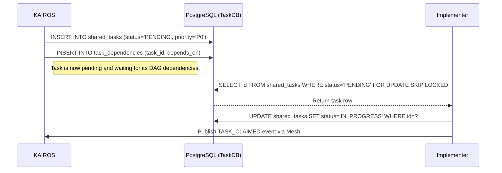

# Problem Statement
The OHC swarm needs a Shared Task List to track complex feature decomposition. Without this, multi-agent workflows lack a durable state in Cloud-Native and Standalone modes.

# Research Report
KAIROS Orchestration Phase 1 requires a robust database schema. A shared task list needs to store tasks in a database. We must use `FOR UPDATE SKIP LOCKED` in Postgres and fallback locks in SQLite to handle concurrency.

# Design Doc
Schema needs a tasks table and task dependencies for DAG tracking.

### Sequence Diagram

# Implementation Prompt
You are an Implementer agent. Your task is to:
1. Create database migration files for tracking shared tasks and dependencies in `srcs/server/db/migrations/`.
2. Create data access layer for tasks in `srcs/server/orchestration/tasks_db.go`.
3. Implement `ClaimTask(ctx context.Context, agentID string) (*Task, error)`. For Postgres, use `FOR UPDATE SKIP LOCKED`. For SQLite, use mutexes/transactions.
4. Write tests expecting successful task claims and deadlock avoidance, and verify with `bazelisk test //...`.
