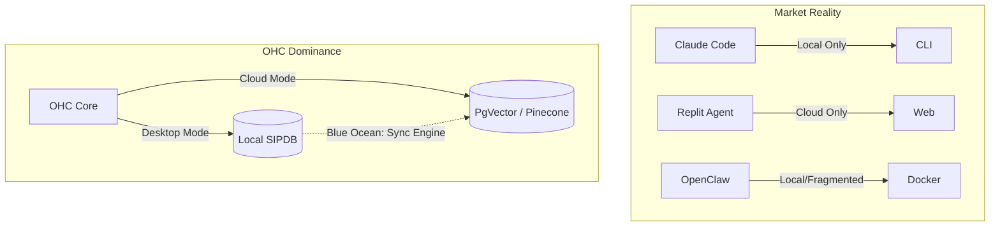

# 🔬 Mission: OHC Hybrid-Native Vector Synchronization (Local-to-Cloud AutoDream)

**Priority**: P0
**Estimated Scope**: Large
**Status**: DONE
**Agent**: jules

## 1. Problem Statement
The current agentic market is deeply fragmented.
- **Claude Code** operates entirely locally with no multi-tenant organizational memory.
- **Replit Agent** is entirely cloud-locked, offering zero privacy for strict on-premise requirements.
- **OpenClaw** attempts local-first but lacks a cohesive deployment model.
OHC's **Hybrid Architecture (OHC-HA)** is superior, but it lacks a seamless, conflict-free synchronization mechanism to move agentic insights ("AutoDream" embeddings) generated in **Standalone Desktop Mode (SQLite)** directly into the **Cloud-Native Mode (PostgreSQL/pgvector)** when a developer reconnects to the enterprise network.

## 2. Research Report
### Competitive Audit: Cloud vs. Local Architectures

| Feature | OHC (Hybrid) | Claude Code | Replit Agent | OpenClaw |
|---------|--------------|-------------|--------------|----------|
| **Local Execution** | ✅ Yes (SQLite) | ✅ Yes | ❌ No | ✅ Yes |
| **Cloud Multi-Tenant** | ✅ Yes (K8s/Postgres) | ❌ No | ✅ Yes | ❌ No |
| **Global Memory** | ✅ Yes (AutoDream) | ❌ No | ✅ Yes (Project) | ❌ No |
| **Seamless Sync** | ⚠️ Needs Sync Engine | N/A | N/A | N/A |

**Disruption Opportunity**: Building a CRDT-based or conflict-resolving synchronization engine for vector embeddings (`AutoDream` sync). This enables agents to work fully offline and merge their memory to the swarm upon reconnection.

## 3. Design Doc
### Architecture
- **Sync Sidecar**: A lightweight Go routine `srcs/server/sync/autodream_sync.go` that monitors local SQLite for un-synced `agent_missions` and `embedding_cache` rows.
- **API Contract**:
  - `POST /api/v1/sync/autodream`
  - Payload: Array of `AutoDream` protobufs.
- **Conflict Resolution**: Cloud timestamp wins, but local-unique insights are appended.

## 4. Implementation Prompt
You are an Implementer agent. Your task is to build the `AutoDream Sync Engine`.
1. **File to create**: `srcs/server/sync/autodream_sync.go`.
2. **Logic**: Implement a polling ticker (`time.Ticker`) that checks the local SQLite database (when `DATABASE_URL` is sqlite) for records with `synced_to_cloud = false`.
3. **Database Changes**: Add a migration script to add a `synced_to_cloud BOOLEAN DEFAULT false` column to the `embedding_cache` table. Remember that for SQLite fallback in Go (`srcs/server/db/database.go`), replace `VECTOR(...)` fields with `BLOB` to support vector embedding parity.
4. **Testing**: Write tests in `srcs/server/sync/autodream_sync_test.go` using an in-memory SQLite DB (`t.Setenv("DATABASE_URL", "sqlite://file::memory:?mode=memory")`). Ensure `ProcessForecastTick()` is used synchronously instead of arbitrary sleeps.
5. **Observability**: Expose Prometheus metrics for `sync_completed_count` and `sync_failed_count` in `srcs/server/telemetry`.
6. Ensure to execute `bazelisk run //:gazelle` after adding Go dependencies.

