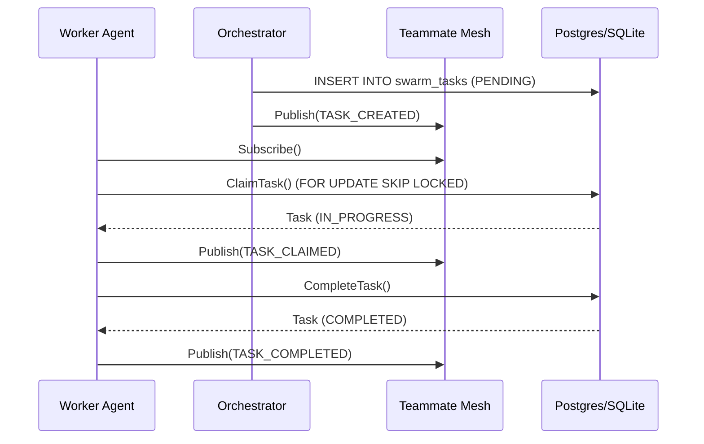

# 🔬 Mission: Implement Shared Task List & State Machine Tracking

**Priority**: P0
**Estimated Scope**: Large

## 1. Problem Statement
The OHC Swarm communicates through various mechanisms like the "Teammate Mesh" for realtime pub/sub. However, it lacks a fully integrated, durable Shared Task List backed by a state machine that can coordinate complex feature implementations and break down tasks across the swarm in a hybrid environment (Cloud Postgres and Local SQLite).

## 2. Research Report
Currently, `srcs/server/orchestration/tasks.go` contains a basic `TaskManager` and `SharedTask` struct. To reach the architectural vision of "KAIROS Orchestrator", this needs to be expanded into a highly scalable background queuing logic with a robust, distributed state machine.

*   **Cloud-Native Mode:** Requires PostgreSQL row-level locks (`FOR UPDATE SKIP LOCKED`) and Redis-backed distributed locks to handle concurrent task polling and state transitions securely.
*   **Standalone Mode:** Must fall back to SQLite concurrent writes locks and in-memory synchronization, avoiding heavy dependencies like Redis.
*   **Observability:** Needs high-fidelity metrics via OpenTelemetry (`swarm_tasks_created`, `swarm_tasks_completed`).

## 3. Design Doc
### Architecture
1.  **State Machine:** Expand `swarm_tasks` to track precise state transitions: `PENDING` -> `IN_PROGRESS` -> `REVIEW` -> `COMPLETED` | `FAILED`.
2.  **State Machine Tracking (Teammate Mesh Dependency):** Integrate state changes into the Realtime Teammate Mesh APIs so other feature agents can coordinate asynchronously.
3.  **Database Migrations:** Create a hybrid migration in `srcs/server/db/migrations/` to add robust indexing on `status` and `locked_until` columns.

### Sequence Diagram

## 4. Implementation Prompt
You are an Implementer agent. Your task is to build out the State Machine Tracking for the Shared Task List.
1.  **Database Migration:** Create a new migration file in `srcs/server/db/migrations/` that adds `REVIEW` status support and `agent_id` tracking if missing, with appropriate indexes for polling. Remember to update `embedsrcs` in `srcs/server/db/BUILD.bazel`.
2.  **TaskManager Enhancements:** Update `srcs/server/orchestration/tasks.go` to support the new state transitions. Add a `ReviewTask` method.
3.  **API Endpoints:** Create `POST /api/orchestration/tasks`, `GET /api/orchestration/tasks`, and `PUT /api/orchestration/tasks/{id}/status` in `srcs/server/orchestration/service.go`.
4.  **Tests:** Write comprehensive unit tests in `srcs/server/orchestration/tasks_test.go` verifying Cloud and Standalone behaviors. Include the `ClearSemaphore()` teardown pattern if testing concurrency.
5.  **Metrics:** Expose Prometheus metrics for task state transitions using `go.opentelemetry.io/otel/metric`. Use Glassmorphism aesthetic tokens in any UI wireframes or dashboard JSONs.

**Acceptance Criteria:**
*   All state transitions (`PENDING` -> `IN_PROGRESS` -> `REVIEW` -> `COMPLETED`) are durable and broadcast over the Mesh.
*   API endpoints are secured using SPIFFE/SPIRE identity middleware.
*   100% test coverage for new task transitions.
*   Metrics emitted correctly.
