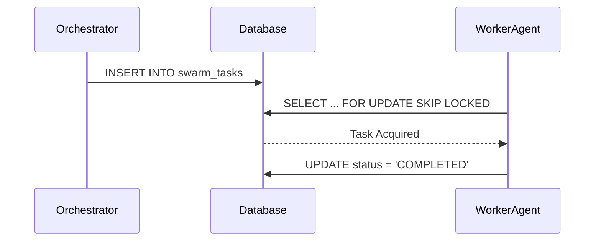

# 🚀 Mission: Architect Shared Task List & Teammate Mesh

**Priority**: P0
**Estimated Scope**: Large

## 1. Problem Statement
To realize the absolute autonomy of the OHC Swarm, we need robust backend architectural systems that facilitate high-throughput, low-latency agent coordination and memory consolidation. Specifically, agents need a robustly shared task queue (Shared Task List), a real-time messaging fabric (Teammate Mesh), and a durable vectorized memory layer (autoDream pgvector pipelines).

## 2. Research Report
- **Shared Task List**: Needs PostgreSQL row-level locking (e.g. `FOR UPDATE SKIP LOCKED`) for Cloud mode to avoid worker collision. SQLite in Standalone mode requires application-level semaphores or simple `Begin` transaction blocking.
- **Teammate Mesh**: A Redis Pub/Sub backend ensures sub-millisecond latencies for agent broadcast messages in Cloud mode. Standalone Mode relies on Go native channels.
- **autoDream Pipelines**: By embedding `swarm_memory_embeddings` using pgvector in PostgreSQL, the system can instantly perform similarity searches for agent context injection.

## 3. Design Doc

### Aesthetic Excellence Mandate
Ensure any dashboard components reflecting these backend processes strictly adhere to the OHC Premium Feel:
```css
.ohc-card {
    backdrop-filter: blur(20px) saturate(200%);
    background: rgba(255, 255, 255, 0.03);
    font-family: 'Outfit', 'Inter', sans-serif;
}
```

### Shared Task List Architecture
- **Table**: `swarm_tasks`
- **Fields**: `id`, `mission_id`, `parent_plan_id`, `dependencies` (JSON), `title`, `payload` (JSON), `status` (PENDING, IN_PROGRESS, COMPLETED, FAILED), `locked_until`, `created_at`, `updated_at`
- **Sequence**:


### Realtime Teammate Mesh APIs
- **Go Interfaces**: `Publish(ctx context.Context, channel string, data []byte) error` & `Subscribe(ctx context.Context, channel string) (<-chan []byte, error)`
- **Cloud Implementer**: rueidis.Client
- **Standalone Implementer**: `map[string][]chan []byte`

### autoDream pgvector Pipelines
- **Table**: `swarm_memory_embeddings`
- **Schema**: `memory_id`, `context` (TEXT), `vector_embedding` (vector(1536)), `source_plugin` (TEXT)
- **Integration**: On mission completion, the payload and logs are embedded via Minimax/OpenAI and Upserted into this table. Subsequent tasks perform an inner-product or cosine similarity (`<=>`) search.

## 4. Implementation Prompt
You are an Implementer agent. Your task is to execute the KAIROS architecture.
1. **Shared Tasks**: Go to `srcs/server/orchestration/tasks.go` and implement task delegation logic using distributed Redis locks for cross-node synchronization where PostgreSQL `SKIP LOCKED` isn't fully viable for hybrid scenarios.
2. **Teammate Mesh**: Implement Redis Pub/Sub in `srcs/server/interop/mesh.go`.
3. **autoDream**: Add pgvector SQL migration and the Go code to insert embeddings into `swarm_memory_embeddings` in `srcs/server/orchestration/autodream.go`.
4. Ensure 90%+ code coverage for all new files.
