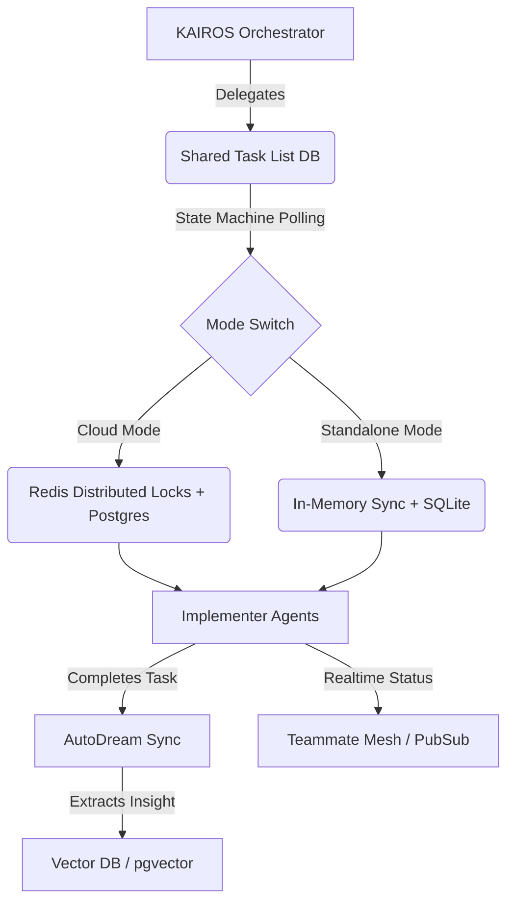

# 🔬 Mission: KAIROS Hybrid Orchestration & Shared Task List Engine

**Priority**: P0
**Estimated Scope**: Large

## 1. Problem Statement
The OHC Hybrid Agentic OS requires an advanced, decentralized state machine and a durable task delegation mechanism to orchestrate complex multi-agent workflows. As we embrace "UltraPlan" deep-deliberation cycles, we lack the robust schema and message-passing infrastructure to reliably execute and observe distributed workflows (e.g., Shared Task List, real-time Teammate Mesh, AutoDream memory consolidation) across both Cloud-Native (Multi-tenant Postgres/Redis) and Standalone Desktop (SQLite/In-Memory) modes without race conditions.

## 2. Research Report
### Market Reality vs. OHC Vision
| Feature | Competitors (Celery, BullMQ, Temporal) | OHC Hybrid Architecture Vision |
|---------|----------------------------------------|---------------------------------|
| **Deployment Mode** | Typically Cloud-Locked (requires Redis/Postgres) | Graceful Degradation (Cloud Redis -> Local Channels) |
| **Agentic Semantics** | Dumb Queues (payload only) | Semantic Matching, Vector Indexed (AutoDream) |
| **State Tracking** | Centralized Database/Locks | Distributed "Teammate Mesh" via Pub/Sub & Mesh channels |
| **Memory** | Ephemeral or logs only | Long-term consolidation via pgvector/Pinecone embeddings |

### Deep Deliberation (UltraPlan) Insights
We must decompose orchestration into three foundational pillars:
1. **Shared Task List & State Machine**: A durable registry tracking Task Dependencies (e.g., DAG structures, task blockers).
2. **Sub-Agent Orchestration (Queueing)**: Background pollers that safely consume from the Task List using Distributed Locks.
3. **AutoDream Memory Sync**: A pipeline that converts finished tasks into embeddings (using `orchestration.MinimaxClient`) and syncs SQLite offline findings into Postgres vector stores.

## 3. Design Doc
### Architecture Diagram

### API Contracts & Schema
1. **DB Schema Additions (Hybrid)**:
   - `tasks` table: `id`, `parent_id`, `status`, `payload`, `agent_role`, `created_at`, `updated_at`
   - `task_dependencies` table: `task_id`, `depends_on_task_id`
2. **Interfaces (`srcs/server/orchestration/orchestrator.go`)**:
   - `CreateTask(ctx context.Context, req CreateTaskRequest) (string, error)` (uses `generateID()`)
   - `AcquireNextTask(ctx context.Context, role string) (*Task, error)`
3. **Teammate Mesh Enhancements**:
   - WebSocket/gRPC PubSub events for `task:created`, `task:completed`, `mesh:tasks`

## 4. Implementation Prompt
You are an Implementer agent. Your task is to implement the KAIROS Shared Task List and Sub-Agent Orchestration engine.
1. **Database Models**: Add hybrid-compatible SQL migrations for the shared task list and dependency graph in `srcs/server/db/migrations/`. Ensure you append them to `embedsrcs` in `srcs/server/db/BUILD.bazel`. Use `UUID PRIMARY KEY DEFAULT gen_random_uuid()` (the engine handles SQLite conversion).
2. **Orchestrator Service**: Create `srcs/server/orchestration/orchestrator.go`. Implement `CreateTask` and `AcquireNextTask` using the database. Utilize `generateID()` (not `generateUUID()`) for internal references. Include proper strict `LIMIT` clauses (e.g., `LIMIT 100`) when polling the database to prevent memory exhaustion.
3. **Queue Logic**: Implement distributed locks for task acquisition. When dealing with channels or retries, safely drain capacity-1 channel semaphores with defer closures to avoid deadlocks.
4. **Teammate Mesh Integration**: Publish state changes to the `TeammateMesh` over the `mesh:tasks` channel.
5. **Observability**: Expose `tasks_created_total` and `tasks_acquired_total` counters in `srcs/server/telemetry/telemetry.go` and increment them appropriately.
6. **Testing**: Write comprehensive tests in `srcs/server/orchestration/orchestrator_test.go`. Test both Postgres and SQLite modes, avoiding identical timestamp truncation by limiting concurrent insertions or forcing distinct times.
7. **Rules**: All code must adhere to OHC-SIP and the Zero Secrets policy (SPIFFE/SPIRE).

