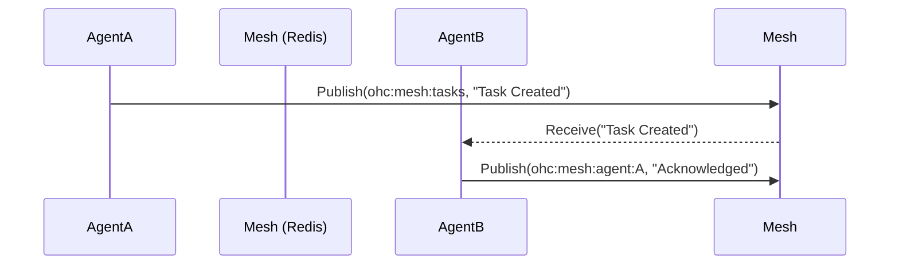

# Title: Architect Shared Task List, Teammate Mesh, and AutoDream

## Problem Statement
The One Human Corp (OHC) platform requires a robust "Hybrid Agentic OS" where a swarm of AI agents can autonomously coordinate, decompose complex feature requests, and share long-term memory. Currently, the platform lacks a central "KAIROS" orchestration layer with a shared task list, real-time teammate mesh communication, and long-term memory consolidation mechanisms (AutoDream). This limits the agents' ability to work together efficiently, remember past context, and execute complex workflows without stepping on each other's toes.

## Research Report

### Market Analysis
- **Competitive Landscape**: Orchestration systems like Temporal, BullMQ, and Celery provide strong durability but often lack native LLM-agent semantics (e.g., semantic task matching, AutoDream integration).
- **Current OHC State**: We have `swarm_tasks` and `shared_tasks` tables introduced in recent migrations (`008_swarm_tasks.sql`, `007_teammate_mesh_and_autodream.sql`), alongside basic Redis Pub/Sub capabilities via `github.com/redis/rueidis` in the Teammate Mesh.
- **AutoDream Memory Consolidation**: Agents currently generate transient memories. We need an "AutoDream" background process that periodically processes `.agent-task/memory/` and inserts synthesized, embedded findings into a vector database (e.g., pgvector) for durable state and semantic search.

| Feature | Competitors (BullMQ, Temporal) | OHC Hybrid OS |
| :--- | :--- | :--- |
| **Global Memory** | ❌ No | ✅ Yes (AutoDream) |
| **Mesh Networking** | ❌ No | ✅ Yes (Teammate Mesh) |
| **Task Queue** | ✅ Yes | ✅ Yes (Shared Tasks) |

## Design Doc

### 1. Shared Task List (PostgreSQL/SQLite)
- A durable state machine for agent tasks.
- **Table Structure:** Add a migration (if not already fully fleshed out in `014_task_dependencies.sql` / `013_shared_tasks.sql` etc.) for a `shared_tasks` table.
  - Columns: `id`, `title`, `description`, `status` (PENDING, IN_PROGRESS, COMPLETED, BLOCKED), `assigned_agent`, `dependencies` (JSON or separate table), `created_at`, `updated_at`.
- **APIs:** Add endpoints in `srcs/server/orchestration/`:
  - `POST /api/v1/tasks` (Create)
  - `GET /api/v1/tasks` (List, with filters)
  - `PUT /api/v1/tasks/{id}/status` (Update status)

### 2. Teammate Mesh (Redis Pub/Sub)
- A highly available real-time communication layer for agent coordination.
- **Service:** Implement `MeshService` in `srcs/server/orchestration/mesh.go` using `github.com/redis/rueidis`.
- **Channels:**
  - `ohc:mesh:tasks` (broadcast when tasks are created/updated).
  - `ohc:mesh:agent:{agent_id}` (direct messages/delegation).
- **APIs:**
  - `POST /api/v1/mesh/broadcast`
  - `POST /api/v1/mesh/direct`
  - WebSocket or SSE endpoint for real-time connection from thin clients.

### 3. AutoDream Data Pipelines (pgvector/SQLite + LLM)
- Background memory consolidation system.
- **Table Structure:** Ensure migration exists for `agent_memories` / `swarm_long_term_memory` (using pgvector extension in PostgreSQL).
  - Columns: `id`, `content`, `embedding` (VECTOR(1536)), `metadata` (JSON), `created_at`.
- **Worker:** `AutoDreamWorker` in `srcs/server/orchestration/autodream.go`.
  - Periodically processes `.agent-task/memory/*.yml`.
  - Generates embeddings using `orchestration.MinimaxClient` (`GenerateEmbedding`).
  - Inserts into `agent_memories`.
- **AutoDream Hook:** When a task reaches `COMPLETED`, trigger an asynchronous goroutine to summarize and embed the task context, injecting it into `agent_memories`.

## Implementation Prompt
You are an Implementer agent. Your task is to implement the Core Backend for Shared Task List, Teammate Mesh, and AutoDream.

1.  **Shared Task List**: Review existing migrations (e.g., `013_shared_tasks.sql`). If needed, create a new one to refine the schema. Implement CRUD Go APIs in `srcs/server/orchestration/tasks.go`.
2.  **Teammate Mesh**: Implement `MeshService` in `srcs/server/orchestration/mesh.go` utilizing Redis Pub/Sub (`rueidis`). Expose broadcast/direct messaging APIs.
3.  **AutoDream Pipelines**: Implement `AutoDreamWorker` in `srcs/server/orchestration/autodream.go` to parse `.agent-task/memory/*.yml`, embed using `MinimaxClient`, and store in `agent_memories` table (with pgvector support via `dbWrapper` handling PostgreSQL vs. SQLite).
4.  **Tests**: Ensure >90% coverage for new modules. Use `bazelisk test //srcs/server/orchestration:orchestration_test`. Use `defer ClearSemaphore()` to avoid deadlocks in tests.

## Priority
P0

## Estimated Scope
Large
