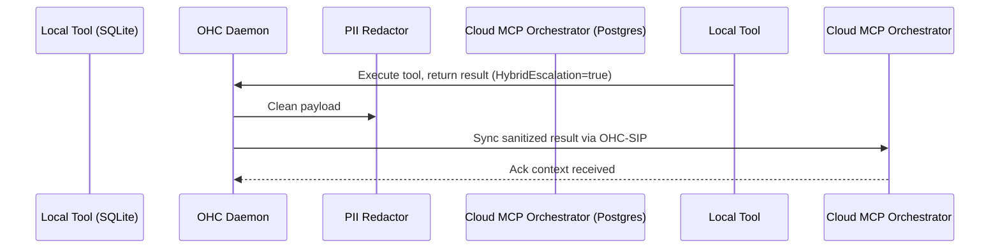

# 🔬 Mission: Implement Hybrid MCP Bridge (Local SQLite to Cloud Postgres Sync)

**Priority**: P0
**Estimated Scope**: Large

## 1. Problem Statement
The One Human Corp (OHC) Agentic OS currently utilizes the Model Context Protocol (MCP) to dynamically connect tools to agents. However, in our Hybrid Architecture, there is a critical capability gap. Standalone Mode (local SQLite) tools and Cloud Mode (Postgres/Redis) tools cannot currently cross-communicate or share context seamlessly. We need a "Hybrid MCP Bridge" that synchronizes state across the boundary, enabling tools executed locally to inform cloud-based multi-tenant operations, and vice versa.

## 2. Research Report
- **Competitor Landscape**: Neither Replit Agent nor Claude Code natively supports a robust offline-to-cloud tool bridging mechanism. Both rely heavily on their cloud environments.
- **OHC Unfair Advantage**: By capitalizing on our Hybrid Architecture (OHC-HA), we can enable a local daemon to securely execute sensitive MCP tools locally (e.g., against local file systems) and sync a generalized, PII-redacted summary via OHC-SIP to the multi-tenant K8s cloud for heavier distributed tasks.
- **Data Privacy**: Local tools operate on raw data; the sync payload must use the `telemetry.RedactInterfacePII` function before hitting the Cloud.
- **Sync Mechanism**: Requires an extension of the existing MCP tool execution logic to flag results for "cloud_escalation" if necessary, and a sync daemon that writes to the local `agent_missions` table which the cloud then consumes.

## 3. Design Doc
### Architecture
1. **MCP Tool Extension**: Extend `srcs/server/agents/mcp/` to support a `HybridEscalation` flag on tool execution results.
2. **Local Daemon Integration**: Update the local SQLite sync process to push MCP tool results to the Cloud.
3. **Redaction Layer**: Ensure the sync pipeline recursively redacts PII using `telemetry.RedactInterfacePII`.
4. **Cloud Receiver**: Expose an API endpoint in the Cloud environment to receive synced MCP context payloads.

### Sequence Diagram

## 4. Implementation Prompt
You are an Implementer agent. Your task is to execute the Hybrid MCP Bridge architecture.

1. **MCP Context Update**: Modify `srcs/server/agents/mcp/client.go` (or equivalent) to append an `Escalation` field to the execution result payload.
2. **PII Redaction integration**: Ensure `telemetry.RedactInterfacePII` is called on the MCP payload before saving it to `agent_missions` for cloud syncing.
3. **Database Changes**: The existing `agent_missions` table in SQLite must track these context payloads. The sync daemon handles the actual transport.
4. **Testing Requirements**:
    - 100% test coverage for the redaction pipeline within the MCP tool execution flow.
    - Write a unit test `hybrid_mcp_bridge_test.go` simulating a local tool result being properly formatted and redacted.
    - If running standalone, set `OHC_STANDALONE=true` in the test.
5. **Aesthetics**: Ensure any UI reflecting these syncs uses Glassmorphism styling (`backdrop-filter: blur(20px) saturate(200%);`).
