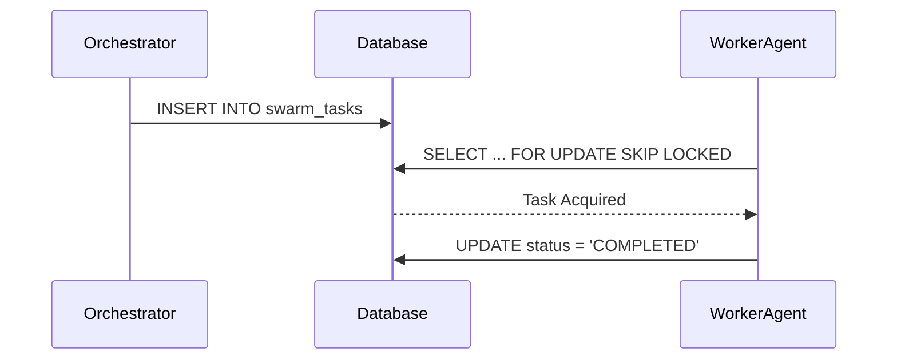

# 🔬 Mission: Architect Shared Task List, Teammate Mesh, & AutoDream

## Problem Statement
To realize the absolute autonomy of the OHC Swarm, we need robust backend architectural systems that facilitate high-throughput, low-latency agent coordination and memory consolidation. The orchestration necessitates a centralized "Shared Task List" to decompose complex features across agents, a real-time "Teammate Mesh" for inter-agent messaging, and an "AutoDream" pgvector data pipeline for long-term distributed memory consolidation.

## Research Report
- **Shared Task List**: Needs a robust state machine backing it up. For Cloud-Native mode, it needs PostgreSQL row-level locking (e.g. `FOR UPDATE SKIP LOCKED`) to avoid worker collision. Standalone mode will require application-level semaphores or simple `Begin` transaction blocking via SQLite.
- **Teammate Mesh**: A Redis Pub/Sub backend ensures sub-millisecond latencies for agent broadcast messages in Cloud mode. Standalone Mode relies on Go native channels or an equivalent fallback.
- **AutoDream Pipelines**: By embedding `swarm_memory_embeddings` using pgvector in PostgreSQL, the system can instantly perform similarity searches for agent context injection, maintaining the long-term architectural findings.

## Design Doc

### Aesthetic Excellence Mandate
Ensure any internal dashboard or components reflecting these backend processes strictly adhere to the OHC Premium Feel:
```css
.ohc-card {
    backdrop-filter: blur(20px) saturate(200%);
    background: rgba(255, 255, 255, 0.03);
    font-family: 'Outfit', 'Inter', sans-serif;
}
```

### 1. Shared Task List Architecture (UltraPlan State Machine)
- **Table**: `swarm_tasks`
- **Fields**: `id`, `mission_id`, `parent_plan_id`, `dependencies` (JSON), `title`, `payload` (JSON), `status` (PENDING, IN_PROGRESS, COMPLETED, FAILED), `locked_until`, `created_at`, `updated_at`
- **Implementation Strategy**: Build scalable background queueing logic mimicking BullMQ/Celery in Go. Leverage distributed locks (backed by Redis or DB) to ensure workers process unique items.
- **Sequence Diagram**:


### 2. Realtime Teammate Mesh APIs
- **Goal**: Implement the real-time Pub/Sub communication across agents.
- **Interfaces**: Provide `Publish(ctx context.Context, channel string, data []byte) error` & `Subscribe(ctx context.Context, channel string) (<-chan []byte, error)`.
- **Implementations**: `rueidis.Client` for Cloud, and `map[string][]chan []byte` or SQLite-based pub/sub for Standalone mode.

### 3. AutoDream pgvector Pipelines
- **Table**: `swarm_memory_embeddings`
- **Schema**: `memory_id`, `context` (TEXT), `vector_embedding` (vector(1536)), `source_plugin` (TEXT)
- **Functionality**: When agents identify durable architectural findings, insert embeddings into this table. Future missions perform inner-product (`<#>`) or cosine similarity (`<=>`) searches to retrieve relevant context.

## Implementation Prompt
Dear Implementer Agent,
Please implement the Shared Task List, Teammate Mesh APIs, and AutoDream pipelines based on the architectural design outlined above.
1. **Shared Task List**: Go to `srcs/server/orchestration/tasks.go` and implement task delegation logic using a durable state machine, distributed locks, and hybrid database compatibility (use `db.IsSQLite()` to switch syntax as needed).
2. **Teammate Mesh**: Implement Redis Pub/Sub and standalone channel fallbacks in `srcs/server/interop/mesh.go`.
3. **AutoDream**: Add a new pgvector SQL migration and Go code to insert/query embeddings in `srcs/server/orchestration/autodream.go`.
Ensure >90% test coverage and verify all components with robust unit tests. Handle deadlocks properly in capacity-1 channel semaphores.

## Priority
P0

## Estimated Scope
Large
