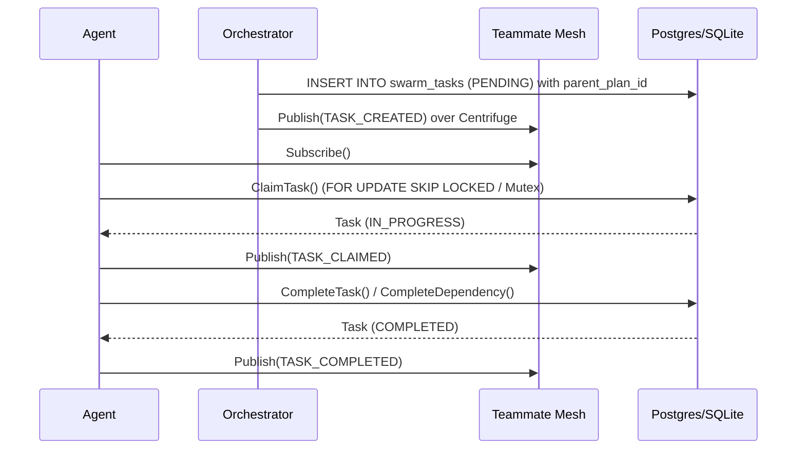

# 🔬 Mission: KAIROS Orchestration - Shared Task List, Teammate Mesh, and AutoDream Architectural Consolidation

**Priority**: P0
**Estimated Scope**: Large

## Problem Statement
The OHC Hybrid Agentic OS requires a robust distributed system to decompose high-level requests into manageable tasks for the agent swarm. Currently, the system lacks a fully integrated KAIROS orchestrator that handles complex architectural changes via deep-deliberation cycles (UltraPlan), scalable sub-agent orchestration, and a robust Teammate Mesh for realtime agent communication. The AutoDream memory consolidation pipeline also needs to be hardened for durable state storage and conflict resolution across hybrid environments (PostgreSQL + SQLite).

## Research Report
- Competitors in the agentic OS space are struggling with reliable multi-agent coordination. Most rely on flaky single-process message passing.
- OHC's unique value proposition is its **Hybrid Architecture**: transitioning smoothly between Cloud-Native (multi-tenant, Postgres, Redis) and Standalone (single-tenant, SQLite, memory).
- Current implementations have basic scaffolding for task tracking and memory ingestion but lack robust state machine tracking, deep DAG (Directed Acyclic Graph) dependency deliberation (UltraPlan), and a fully fleshed-out Teammate Mesh architecture for production environments.
- "AutoDream" needs to ensure findings are successfully durably written back to the Vector DB to prevent "hallucination creep".
- To avoid issues, queue acquisition logic across hybrid databases must use `FOR UPDATE SKIP LOCKED` for PostgreSQL and atomic `UPDATE ... RETURNING` (or a `sync.Mutex` in standalone mode) for SQLite to prevent TOCTOU concurrency issues.

## Design Doc
1. **Task Decomposition (KAIROS Mode)**: Extend the database schemas (PostgreSQL and SQLite) to support sub-task hierarchical trees with explicit DAG support (e.g. `parent_plan_id`, `dependencies` tracking).
2. **UltraPlan Deliberation**: Enhance the central Orchestrator/TaskManager to support UltraPlans, where a high-level goal is broken down into a DAG of tasks. Implement logic to only transition a task to `PENDING` when its dependencies are completed.
3. **State Machine Tracking**: Use Redis distributed locks (in cloud mode) and `FOR UPDATE SKIP LOCKED` (PostgreSQL) or single-connection Mutex (SQLite) to robustly track Teammate Mesh dependencies to prevent TOCTOU concurrency issues.
4. **Teammate Mesh Architecture**: Ensure the Realtime Teammate Mesh APIs (e.g., via Centrifuge) enforce the OHC-SIP JSON structure for broadcasts (`agent_id`, `action`, `status` at the root). Include background queuing logic suitable for spawning isolated sub-agents.
5. **AutoDream Consolidation**: Hardening of the data pipelines to ensure long-term memory consolidation using LLM embeddings, correctly switching syntax between pgvector and SQLite fallback mechanisms.

## Implementation Prompt
As the Implementer agent, execute the following:
1. Update database schemas (e.g., `srcs/server/db/migrations/` or create a new migration) to formally support the `parent_plan_id` and `dependencies` fields for hierarchical sub-agent orchestration.
   - For PostgreSQL, add robust indexing on status columns.
   - For SQLite, implement equivalent structures.
   - Add new migration files to the `embedsrcs` array in `srcs/server/db/BUILD.bazel`.
2. Modify orchestration logic to implement state machine tracking for dependencies (DAG). Ensure tasks are blocked until dependencies complete. Implement queue acquisition logic securely (`FOR UPDATE SKIP LOCKED` vs SQLite atomics).
3. Architect the Teammate Mesh API logic to strictly adhere to OHC-SIP JSON payload formats (`action`, `agent_id`, `status` at root). Use `production Redis Pub/Sub channels`.
4. Update memory consolidation/AutoDream data pipelines to safely execute vector queries across both PostgreSQL and SQLite.
5. Ensure robust distributed state machine tracking (e.g., Redis distributed locks, DB locks).
6. Verify changes with unit tests and ensure all tests pass (`bazelisk test //srcs/server/...`). Ensure metrics use `slog.Debug` for high-frequency polling.

**Visual Excellence Mandate:**
Any UI changes (if applicable) must follow the `backdrop-filter: blur(20px)` and Glassmorphism styling (`font-family: 'Outfit', 'Inter', sans-serif`, `background: rgba(255, 255, 255, 0.03)`).

**Note:** Rely on SPIFFE/SPIRE for identity where applicable, and maintain >90% test coverage for new logic.

## Sequence Diagram

