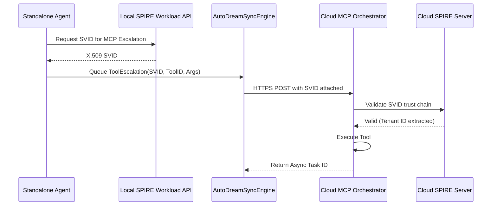

# 🔬 Mission: Implement Local-to-Cloud MCP Privilege Escalation via SPIFFE/SPIRE

**Priority**: P0
**Estimated Scope**: Large

## 1. Problem Statement
The current Hybrid MCP Bridge provides a basic mechanism to synchronize PII-redacted tool execution contexts from local Standalone (SQLite) instances to the Cloud (Postgres). However, it lacks a formalized privilege escalation protocol. When a locally running agent requires execution of a cloud-only MCP tool (e.g., modifying production billing via Stripe MCP or provisioning K8s resources), it has no secure mechanism to request the Cloud to run the tool on its behalf while maintaining zero-trust identity boundaries.

## 2. Research Report
- **Competitor Landscape**: Standard remote tool execution often relies on static API keys or long-lived JWTs.
- **OHC Unfair Advantage**: By combining our `AutoDreamSyncEngine` with SPIFFE/SPIRE, we can establish ephemeral, cryptographically verifiable trust boundaries. A local agent can pass a cryptographic proof of its intent to the cloud.
- **Security Posture**: In "Cloud Mode", multi-tenant boundaries must be strictly enforced. The cloud orchestrator must verify the SPIFFE ID of the local standalone agent before executing any escalated MCP tools.

## 3. Design Doc
### Architecture
1. **MCP Escalation Request Model**: Expand `AutoDreamPayload` (in `srcs/server/sync/autodream_sync.go`) or create a new `mcp_escalation` type.
2. **SPIFFE SVID Injection**: The local OS must acquire a short-lived SVID (SPIFFE Verifiable Identity Document) from the local SPIRE agent and attach it to the escalation payload.
3. **Cloud Verifier**: The Cloud Receiver API must validate the SVID against the SPIRE server trust bundle, extract the user/org ID, and verify permissions before proxying the request to the cloud-native MCP tool.
4. **Execution and Callback**: The cloud executes the MCP tool and queues the result in `shared_tasks` for the local agent to pull on its next sync tick.

### Sequence Diagram

## 4. Implementation Prompt
You are an Implementer agent. Your task is to execute the Local-to-Cloud MCP Privilege Escalation via SPIFFE/SPIRE.

1. **Payload Expansion**: Modify `srcs/server/sync/autodream_sync.go` to support a new payload type for MCP escalation, including a field for an X.509 SVID token.
2. **SVID Fetching**: Create a utility in `srcs/server/auth/` (or similar) to interact with the local SPIRE workload API (`unix:///tmp/spire-agent/public/api.sock`) to fetch a JWT-SVID or X.509 SVID.
3. **Cloud Verification**: Implement middleware on the Cloud Receiver endpoint to parse and validate incoming SVIDs using the `go-spiffe/v2` library.
4. **Testing Requirements**:
    - Add >90% test coverage for the SVID validation logic.
    - Write unit tests mocking the SPIFFE workload API interactions.
5. **Observability**: Ensure telemetry metrics are emitted for successful and failed escalation validations.
