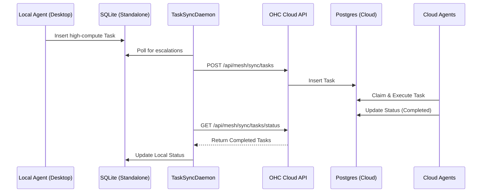

# Mission: Implement Local-to-Cloud Task Escalation and Sync (Offline-First Hybrid Swarm)

## Problem Statement
Current competitors (Claude Code, Replit Agent, OpenClaw) either operate entirely in the cloud or solely locally without a seamless bridge. OHC's Hybrid Architecture provides both Standalone Desktop (SQLite) and Cloud-Native (Postgres/K8s) modes. However, local agents lack the ability to autonomously escalate high-compute tasks to the cloud swarm or queue tasks while offline for later synchronization. This limits the true potential of a "Hybrid" OS.

## Research Report
### Competitive Analysis
| Platform | Standalone Local Execution | Cloud Swarm Scalability | Offline-to-Cloud Sync | UX Aesthetic |
|----------|----------------------------|-------------------------|-----------------------|--------------|
| **OHC**  | ✅ Yes (SQLite)              | ✅ Yes (K8s/Postgres)    | ❌ No (Target Feature)  | Premium (Glassmorphism) |
| Claude Code | ❌ No (Requires Connection) | ✅ Yes (API)             | ❌ No                 | Standard CLI |
| Replit Agent | ❌ No (Cloud IDE only)      | ✅ Yes (Replit Cloud)    | ❌ No                 | Standard Web |
| OpenClaw  | ✅ Yes (Local OS)           | ⚠️ Partial (Complex Setup)| ❌ No                 | Basic UI |

**Conclusion:** Implementing seamless background synchronization of tasks between the local SQLite `shared_tasks` database and the cloud Postgres database will create a true "Blue Ocean" advantage.

## Design Doc
### Architecture
The feature consists of a `TaskSyncDaemon` that runs in Standalone mode.
1. Local agent inserts a task into SQLite `shared_tasks` with `requires_escalation=true` or when offline.
2. `TaskSyncDaemon` polls SQLite for pending tasks.
3. Upon cloud connection, the daemon pushes tasks to the OHC Cloud REST API (`/api/mesh/sync/tasks`).
4. The cloud API inserts tasks into Postgres, where the cloud swarm picks them up.
5. The daemon polls the cloud for task completion and updates the local SQLite DB.

### Mermaid Diagram


### UI Styling (Glassmorphism)
The UI displaying synced tasks should use the OHC Glassmorphism tokens:
```css
.sync-card {
    background: rgba(255, 255, 255, 0.03);
    backdrop-filter: blur(20px) saturate(200%);
    border: 1px solid rgba(255, 255, 255, 0.1);
    border-radius: 12px;
    font-family: 'Outfit', 'Inter', sans-serif;
    color: #ffffff;
}
```

## Implementation Prompt
**Objective:** Implement the `TaskSyncDaemon` in Go to bridge local SQLite and Cloud Postgres.
1. **Create `srcs/server/orchestration/sync_daemon.go`**:
   - Implement a daemon that runs when `OHC_MULTITENANT=false` (Standalone).
   - Function `PollLocalTasks(ctx context.Context, db *sql.DB)` to find tasks requiring sync.
   - Function `PushToCloud(ctx context.Context, tasks []Task)` to send them to the Cloud API.
2. **Implement Cloud Endpoints**:
   - In `srcs/server/dashboard/server.go`, add endpoints for `/api/mesh/sync/tasks` (POST for incoming tasks, GET for status). Ensure SPIFFE/SPIRE authentication or JWT token validation is present.
3. **Tests**:
   - Create `srcs/server/orchestration/sync_daemon_test.go`.
   - Use in-memory SQLite (import `_ "modernc.org/sqlite"`) to mock local state.
   - Verify that tasks are correctly extracted and payloads are sanitized before sending.

**Constraints:** Ensure all synced payloads are scrubbed using `telemetry.RedactInterfacePII` and `orchestration.SanitizePayloadMap` to strip `[PRIVATE:*]` markers before cloud transmission. Ensure `OHC_TELEMETRY_ENABLED` is checked.

## Priority
P0

## Estimated Scope
Medium
