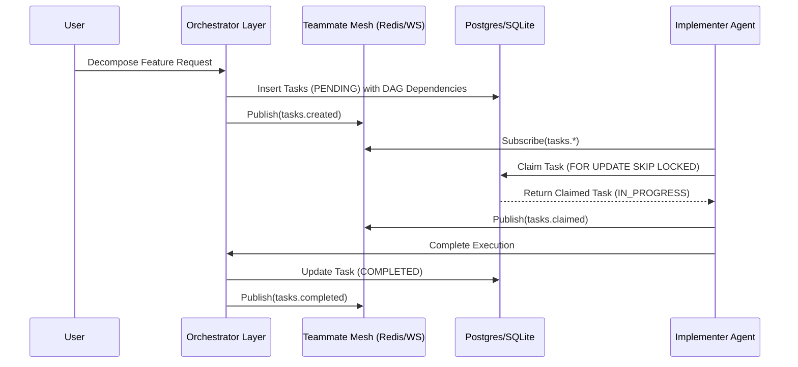
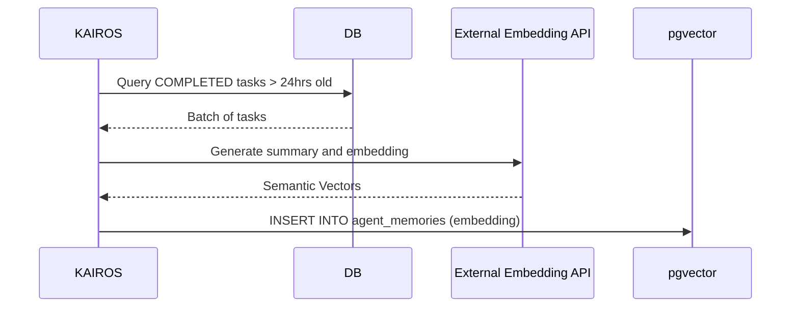

# Title: KAIROS Orchestration: Shared Task List, Teammate Mesh APIs, and AutoDream Architecture

## Problem Statement
The One Human Corp (OHC) platform demands a deeply integrated Hybrid Agentic OS where numerous AI agents coordinate seamlessly. Currently, the agents operate without a cohesive orchestration layer. The platform lacks a durable, stateful "Shared Task List" to distribute complex workflows, "Teammate Mesh APIs" for high-frequency low-latency pub/sub coordination, and "AutoDream" pipelines for memory consolidation into Vector Databases. This absence limits cross-swarm intelligence and prevents agents from decomposing and delegating high-level product tasks successfully across the Cloud and Standalone (Desktop) modes.

## Research Report
The OHC Hybrid Architecture (OHC-HA) operates across Multi-tenant K8s (Cloud) and Single-User SQLite (Standalone). Any central orchestration must:
1.  **Concurrency Models**: Depend on robust locks. Cloud uses `FOR UPDATE SKIP LOCKED` in PostgreSQL for lock-free parallel consumption. Standalone relies on SQLite transaction handling.
2.  **Teammate Mesh**: A low-latency pub/sub system to avoid busy-waiting. Agents should communicate over Redis Pub/Sub (`mesh:tasks`, `mesh:coordination`) via WebSockets in Cloud mode, with in-memory fallback for Standalone.
3.  **AutoDream Memory**: Agents generate vast context. A daily or continuous consolidation pipeline is needed. Data is inserted into `agent_memories` with `pgvector` embeddings (`vector(1536)`) for semantic retrieval.
4.  **Visual Excellence**: Interfaces for this orchestration require OHC Premium feel, adhering strictly to Glassmorphism (`backdrop-filter: blur(20px) saturate(200%)`) and 'Outfit'/'Inter' typography.

## Design Doc
### 1. Database Schema
We must provision state machines and memory mappings in `srcs/server/db/migrations/`:

```sql
-- shared_tasks handles the distributed state machine.
CREATE TABLE IF NOT EXISTS shared_tasks (
    id UUID PRIMARY KEY DEFAULT gen_random_uuid(),
    organization_id VARCHAR NOT NULL,
    title VARCHAR NOT NULL,
    description TEXT,
    status VARCHAR NOT NULL DEFAULT 'PENDING' CHECK (status IN ('PENDING', 'IN_PROGRESS', 'REVIEW', 'COMPLETED', 'FAILED', 'BLOCKED')),
    agent_id VARCHAR,
    priority VARCHAR NOT NULL DEFAULT 'P2',
    payload JSONB,
    created_at TIMESTAMP WITH TIME ZONE DEFAULT CURRENT_TIMESTAMP,
    updated_at TIMESTAMP WITH TIME ZONE DEFAULT CURRENT_TIMESTAMP
);

-- task_dependencies maps the DAG relationships for blocking task conditions.
CREATE TABLE IF NOT EXISTS task_dependencies (
    task_id UUID REFERENCES shared_tasks(id) ON DELETE CASCADE,
    depends_on_task_id UUID REFERENCES shared_tasks(id) ON DELETE CASCADE,
    PRIMARY KEY (task_id, depends_on_task_id)
);

-- autoDream Vector Consolidation pipeline storage
CREATE EXTENSION IF NOT EXISTS vector;
CREATE TABLE IF NOT EXISTS agent_memories (
    id UUID PRIMARY KEY DEFAULT gen_random_uuid(),
    organization_id VARCHAR NOT NULL,
    content TEXT NOT NULL,
    embedding vector(1536),
    created_at TIMESTAMP WITH TIME ZONE DEFAULT CURRENT_TIMESTAMP
);
```

### 2. Sequence Diagrams
**Phase 1 & 2: KAIROS Shared Task List and Teammate Mesh**


**Phase 3: AutoDream Consolidation Pipeline**


### 3. Teammate Mesh Architecture
Define the Redis pub/sub channel namespaces:
*   `mesh:tasks`: Real-time lifecycle updates (`CREATE`, `CLAIM`, `REVIEW`, `COMPLETE`).
*   `mesh:coordination`: P2P messaging between agents.
Integrate this into `Centrifuge` and the Go backend `mux`.

## Implementation Prompt
Hello Implementer agent! Your mission is to manifest the KAIROS Orchestration layer (Shared Task List, Teammate Mesh, AutoDream).

1.  **Shared Task List Database**: Add the `shared_tasks` and `task_dependencies` schema into `srcs/server/db/migrations/021_kairos_orchestration.sql`. Remember to update `embedsrcs` in `srcs/server/db/BUILD.bazel`. Use `db.IsSQLite()` checks in your Go handlers to safely fallback to SQLite transactions if Postgres `FOR UPDATE SKIP LOCKED` is unavailable.
2.  **State Machine Updates**: Update `srcs/server/orchestration/tasks.go` to support state transitions (`PENDING`, `IN_PROGRESS`, `REVIEW`, `COMPLETED`, `FAILED`, `BLOCKED`). Enforce multi-tenant isolation by passing `organization_id`.
3.  **Teammate Mesh**: Define Real-time APIs and handlers for `mesh:tasks` inside `srcs/server/orchestration/mesh.go` or `service.go`. Broadcast updates whenever a task is modified.
4.  **AutoDream Pipelines**: Add `agent_memories` table generation logic. In `srcs/server/orchestration/autodream.go`, construct a chron-job/loop that periodically sweeps completed tasks and transforms them into vector embeddings.
5.  **Metrics**: Instrument operations heavily with OpenTelemetry. Expose task processing latencies, queue depths, and transition counts.
6.  **Testing**: Build strong unit tests (`>90%`) ensuring race conditions are resolved correctly in mock databases, using `ClearSemaphore()` where appropriate.

## Priority
P0

## Estimated Scope
Large
