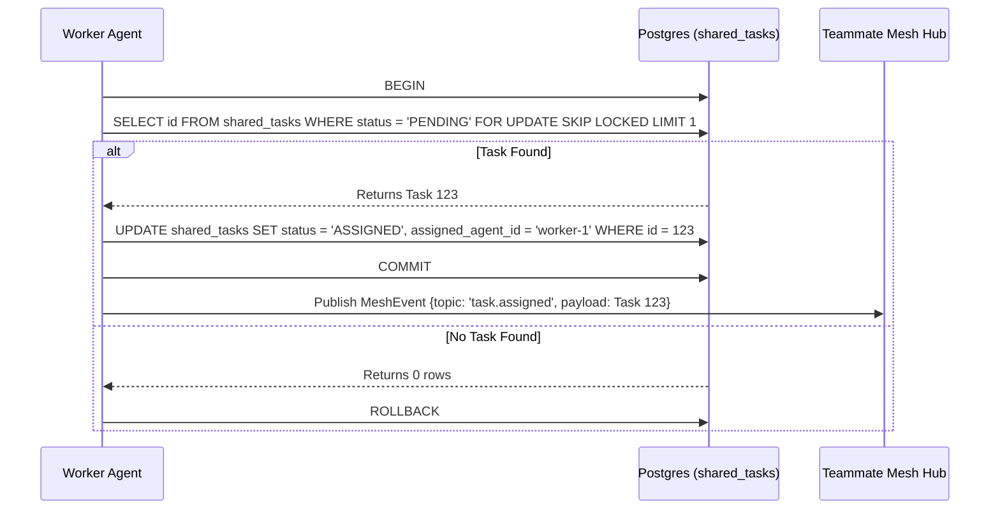

status: IN_PROGRESS
agent: jules

# Problem Statement
The One Human Corp (OHC) platform lacks a central "KAIROS" orchestration layer with a shared task list. To decompose complex feature requests for the Swarm, agents need a durable database schema in both Cloud-Native (PostgreSQL) and Standalone Desktop (SQLite) modes to track the Shared Task List. Without this, complex architectural missions cannot be decomposed or shared securely among agents.

# Research Report
- Based on `CLAUDE_OHC.md` and `README.md`, OHC operates in a "Hybrid Architecture" (`OHC-HA`). The database persistence relies on PostgreSQL for multi-tenant scalability and SQLite for standalone degradation.
- The `shared_tasks` table is critical for representing a global queue of decomposed features.
- We need robust locking: PostgreSQL row-level locks (`FOR UPDATE SKIP LOCKED`) in cloud mode, and application-level semaphores or simple transaction isolation in SQLite standalone mode to prevent worker collision when claiming tasks.

# Design Doc
**Database Schema (`shared_tasks`):**
```sql
CREATE TABLE IF NOT EXISTS shared_tasks (
    id TEXT PRIMARY KEY,
    organization_id TEXT NOT NULL,
    parent_plan_id TEXT,
    title TEXT NOT NULL,
    description TEXT,
    status TEXT NOT NULL DEFAULT 'PENDING',
    assigned_agent_id TEXT,
    dependencies JSONB, -- Stores the compressed array of dependent task IDs
    created_at TIMESTAMPTZ DEFAULT CURRENT_TIMESTAMP,
    updated_at TIMESTAMPTZ DEFAULT CURRENT_TIMESTAMP
);
CREATE INDEX IF NOT EXISTS idx_shared_tasks_org_status ON shared_tasks(organization_id, status);
```

*Note:* `dependencies` uses a JSONB array, avoiding relational `task_dependencies` tables to optimize storage costs as per memory guidelines. `TIMESTAMPTZ` is used for Postgres, while SQLite will handle it appropriately if we translate it in migrations.

# Implementation Prompt
You are an Implementer agent. Your mission is to implement the backend database designs for the "Shared Task List" feature.
1. Create the SQL migration file for `shared_tasks` in `srcs/server/db/migrations/`. Name it appropriately (e.g., `014_shared_tasks.sql`).
2. Add the migration to `embedsrcs` in `srcs/server/db/BUILD.bazel`.
3. Create the data access layer in `srcs/server/orchestration/tasks_db.go`.
4. Implement a `ClaimTask` method.
   - For PostgreSQL (`dbWrapper.Provider().IsSQLite() == false`), you MUST use `SELECT * FROM shared_tasks WHERE status = 'PENDING' FOR UPDATE SKIP LOCKED` to prevent concurrent assignment conflicts.
   - For SQLite Standalone mode, use application-level mutexes `to.mu.Lock()` as described in memory, and standard transaction isolations to claim the task safely.
5. Create unit tests for `tasks_db.go`. If simulating authentication claims in tests, use `context.WithValue(ctx, auth.ClaimsContextKeyForTest, claims)`.
6. Use `bazelisk test //srcs/server/orchestration/...` to verify your code.
7. Remember: You are the Lead for your domain. DO NOT ask for approval. Rely entirely on SPIFFE/SPIRE for identity and auth.

# Visual Excellence Guidelines
Any frontend representation of the Shared Task List later created must apply:
`backdrop-filter: blur(20px) saturate(200%); background: rgba(255, 255, 255, 0.03); font-family: 'Outfit', 'Inter', sans-serif;`

# Sequence Diagram (Shared Task Claiming)

