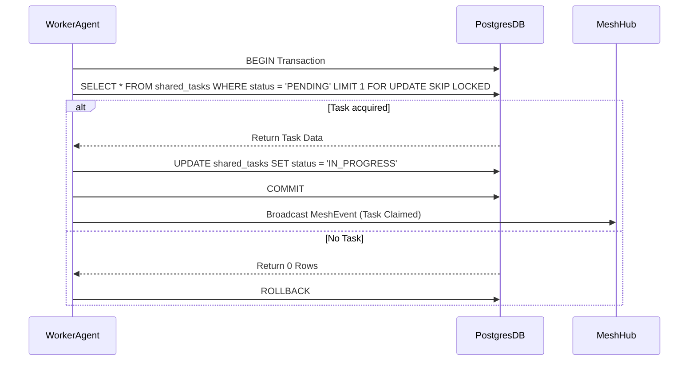

# Problem Statement
The OHC swarm requires a "KAIROS" orchestration layer to decompose complex high-level feature requests into a shared task list. We need robust backend database schema designs and transaction sequences to ensure agents can claim these decomposed tasks securely across Cloud-Native and Standalone modes without collisions.

# Research Report
- OHC architecture operates in a Hybrid Mode (Cloud-Native using PostgreSQL, Standalone using SQLite).
- The `shared_tasks` state must support distributed row locking (`FOR UPDATE SKIP LOCKED`) in PostgreSQL to support horizontal pod concurrency.
- In SQLite Standalone mode, standard application-level or transaction isolation must gracefully degrade while preventing concurrency issues.
- The `dependencies` for tasks should be stored within a JSONB array column on `shared_tasks` rather than a relational `task_dependencies` table, minimizing query overhead and optimizing storage costs.

# Design Doc
**Architecture & Schema:**
- Extend the `shared_tasks` schema to include `dependencies JSONB` and `parent_plan_id TEXT`.

**Sequence Diagram: Task Claiming**

# Implementation Prompt
You are an Implementer agent. Execute the following:
1. Validate the `shared_tasks` table schema in `srcs/server/db/migrations/` and update it to include `dependencies JSONB` and `parent_plan_id TEXT`.
2. Ensure the `ClaimTask` method in `srcs/server/orchestration/tasks.go` appropriately leverages PostgreSQL's `FOR UPDATE SKIP LOCKED`.
3. Add robust unit tests for task polling and dependency tracking.
4. Verify execution with `bazelisk test //srcs/server/orchestration/...`

# Visual Excellence Mandate
Any UI surfacing the Shared Task List must adhere to:
`backdrop-filter: blur(20px) saturate(200%); background: rgba(255, 255, 255, 0.03); font-family: 'Outfit', 'Inter', sans-serif;`
