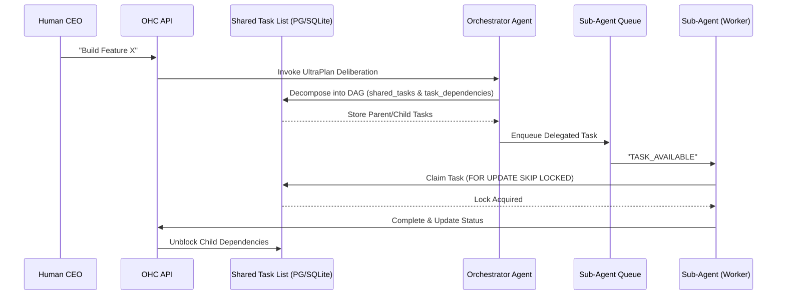

# Problem Statement
The OHC Swarm requires a unified, resilient backbone to seamlessly decompose complex human goals into isolated, parallel agentic workflows. We lack a robust structural and aesthetic architecture for the "Hybrid Agentic OS", including "Shared Task Lists", "Teammate Mesh" for realtime coordination, "Sub-Agent Queues", "Distributed State Machines", and "AutoDream" pipelines for memory consolidation across both Kubernetes/PostgreSQL clouds and local SQLite standalone footprints.

# Research Report
1. **Current Orchestration**: Agent execution often stalls due to complex multi-agent DAG dependencies lacking a strict, distributed state machine.
2. **Realtime Mesh**: The Teammate Mesh lacks strict API definitions and proper Pub/Sub architecture to scale for horizontal deployments (10k msgs/sec multiplexed via WebSockets/gRPC).
3. **Memory Pipeline**: Agents lack long-term coherence. Ephemeral thoughts get lost without an AutoDream vector data pipeline bridging local session state and pgvector representations.
4. **Visual Guidelines**: The UI must reflect a premium aesthetic corresponding to the "Steve Jobs-standard" required for OHC, ensuring standard visual tokens are explicitly documented.

# Design Doc

## 1. Phase 1: Shared Task List (Decomposition)
### 1.1 Backend Database Schema (PostgreSQL)
```sql
CREATE TABLE IF NOT EXISTS shared_tasks (
    id UUID PRIMARY KEY DEFAULT gen_random_uuid(),
    organization_id VARCHAR NOT NULL,
    title VARCHAR NOT NULL,
    description TEXT,
    status VARCHAR NOT NULL DEFAULT 'PENDING',
    agent_id VARCHAR,
    priority VARCHAR NOT NULL DEFAULT 'P2',
    payload JSONB,
    parent_plan_id TEXT,
    locked_until TIMESTAMP WITH TIME ZONE,
    created_at TIMESTAMP WITH TIME ZONE DEFAULT CURRENT_TIMESTAMP,
    updated_at TIMESTAMP WITH TIME ZONE DEFAULT CURRENT_TIMESTAMP
);

CREATE TABLE IF NOT EXISTS task_dependencies (
    task_id UUID NOT NULL REFERENCES shared_tasks(id) ON DELETE CASCADE,
    depends_on_task_id UUID NOT NULL REFERENCES shared_tasks(id) ON DELETE CASCADE,
    PRIMARY KEY (task_id, depends_on_task_id)
);

CREATE TABLE IF NOT EXISTS state_machine_transitions (
    id TEXT PRIMARY KEY,
    entity_id TEXT NOT NULL,
    entity_type TEXT NOT NULL,
    from_state TEXT NOT NULL,
    to_state TEXT NOT NULL,
    agent_id TEXT,
    reason TEXT,
    occurred_at TIMESTAMPTZ DEFAULT CURRENT_TIMESTAMP
);
CREATE INDEX idx_sm_entity ON state_machine_transitions(entity_id, entity_type);
```

### 1.2 Sequence Diagram: UltraPlan Deliberation


## 2. Phase 2: Orchestration (Teammate Mesh Architecture)
- **Transport Layer**: Realtime communication backed by WebSockets / gRPC locally, and Redis Pub/Sub for horizontal scaling in Cloud-Native Mode.
- **Event Bus Channels**:
  - `mesh:tasks` - Broadcasts task transitions (CREATE, CLAIM, COMPLETE).
  - `mesh:coordination` - Agents announce presence, request locks, and share immediate findings.
- **Message Format**: Standard HTTP POSTs to API (e.g., `POST /api/mesh/broadcast`) and updated gRPC contracts (`srcs/proto/hub.proto`).
  ```json
  {
    "event_type": "TASK_CLAIMED",
    "agent_id": "Worker-1",
    "action": "execute",
    "status": "success",
    "payload": {
      "task_id": "123e4567-e89b-12d3-a456-426614174000",
      "timestamp": "2026-04-05T22:45:00Z"
    }
  }
  ```

## 3. Phase 3: autoDream (Memory Consolidation Pipeline)
- **Data Source**: Ephemeral context streams from `.agent-task/memory/{timestamp}.yml` and session data.
- **Ingestion Pipeline**: The AutoDream background pipeline asynchronously reads findings, chunks text, generates embeddings via LLM providers, and stores them via `pgvector`.
- **Vector Storage Schema (PostgreSQL)**:
  ```sql
  CREATE EXTENSION IF NOT EXISTS vector;
  CREATE TABLE IF NOT EXISTS autodream_memories (
      id UUID PRIMARY KEY DEFAULT gen_random_uuid(),
      organization_id VARCHAR NOT NULL,
      topic TEXT NOT NULL,
      content TEXT NOT NULL,
      embedding vector(1536),
      source_type TEXT NOT NULL DEFAULT 'autoDream',
      created_at TIMESTAMP WITH TIME ZONE DEFAULT CURRENT_TIMESTAMP
  );
  CREATE INDEX ON autodream_memories USING hnsw (embedding vector_l2_ops);
  ```

## 4. Visual Excellence Mandate
Adhering to OHC Core Values, the UI components tracking the KAIROS Orchestration MUST implement:
- `backdrop-filter: blur(20px) saturate(200%)`
- `background: rgba(255, 255, 255, 0.03)`
- `font-family: 'Outfit', 'Inter', sans-serif`

# Implementation Prompt
You are an Implementer agent tasked with realizing the KAIROS Orchestration framework.
1. Implement the `shared_tasks`, `task_dependencies`, and `state_machine_transitions` schemas in the database migrations.
2. Build the Teammate Mesh APIs in `srcs/server/orchestration/hub.go` mapped to `mesh:tasks` and `mesh:coordination` Redis channels, enforcing mTLS.
3. Construct the `AutoDreamPipeline` orchestrator worker to vectorize memory YAMLs and interface with `pgvector`.
4. Guarantee that any human-facing UI generated from these operations strictly adopts the specified `backdrop-filter`, `background`, and typography CSS rules.
5. Provide comprehensive unit and integration tests (>95% coverage) driven entirely by Bazel, avoiding manual test runners. Validate using `bazelisk test //srcs/server/...`.