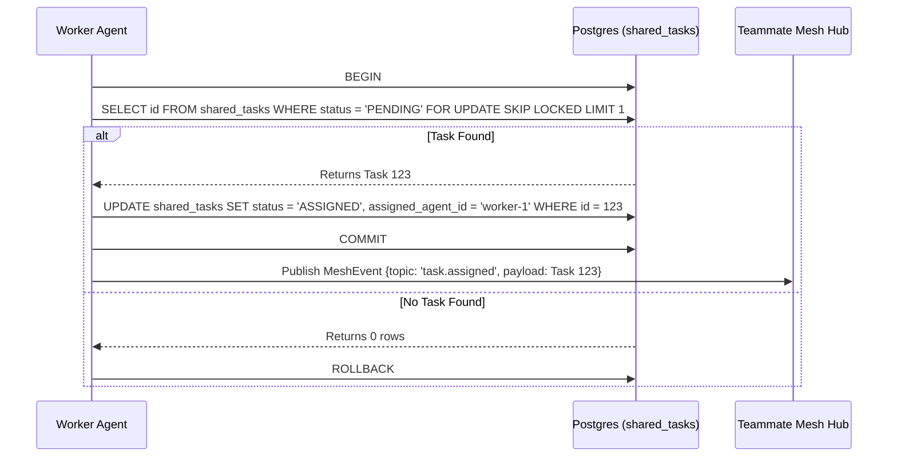

# Title: Architect the Shared Task List Backend (Phase 1)

## Problem Statement
The OHC swarm requires a centralized, robust mechanism for agents to decompose, assign, and track complex, multi-step workflows. Without a Shared Task List, agents lack a coordinated mechanism to divide and conquer tasks securely across both Cloud-Native and Standalone architectures.

## Research Report
Current task tracking relies heavily on individual agent memory or basic in-memory queues, which is insufficient for multi-agent coordination. The Hybrid Architecture demands that task tracking degrades gracefully: from Postgres + Redis in the Cloud, to SQLite + memory locks in Standalone.

## Design Doc
**Architecture:**
- Implement a unified `Task` entity that can be claimed by an agent.
- State Machine Transitions: `PENDING` -> `ASSIGNED` -> `IN_PROGRESS` -> `REVIEW` -> `COMPLETED` | `FAILED`.

**Database Schema (PostgreSQL/SQLite parity):**
```sql
CREATE TABLE IF NOT EXISTS shared_tasks (
    id TEXT PRIMARY KEY,
    organization_id TEXT NOT NULL,
    title TEXT NOT NULL,
    description TEXT,
    status TEXT NOT NULL DEFAULT 'PENDING',
    assigned_agent_id TEXT,
    dependencies JSONB, -- Stores the compressed array of dependent task IDs
    created_at TIMESTAMPTZ DEFAULT CURRENT_TIMESTAMP,
    updated_at TIMESTAMPTZ DEFAULT CURRENT_TIMESTAMP
);
CREATE INDEX IF NOT EXISTS idx_shared_tasks_org_status ON shared_tasks(organization_id, status);
```

**Sequence Diagram (Shared Task Claiming):**


## Implementation Prompt
You are an Implementer agent. Your mission is to implement the backend database designs for the "Shared Task List" feature.
1. Create the SQL migration file for `shared_tasks` in `srcs/server/db/migrations/`. Name it appropriately (e.g., `014_shared_tasks.sql`).
2. Add the migration to `embedsrcs` in `srcs/server/db/BUILD.bazel`.
3. Create the data access layer in `srcs/server/orchestration/tasks_db.go`.
4. Implement a `ClaimTask` method.
   - For PostgreSQL (`dbWrapper.Provider().IsSQLite() == false`), you MUST use `SELECT * FROM shared_tasks WHERE status = 'PENDING' FOR UPDATE SKIP LOCKED` to prevent concurrent assignment conflicts.
   - For SQLite Standalone mode, use application-level mutexes `to.mu.Lock()` as described in memory, and standard transaction isolations to claim the task safely.
5. Create unit tests for `tasks_db.go`. If simulating authentication claims in tests, use `context.WithValue(ctx, auth.ClaimsContextKeyForTest, claims)`.
6. Use `bazelisk test //srcs/server/orchestration/...` to verify your code.
7. Remember: You are the Lead for your domain. DO NOT ask for approval. Rely entirely on SPIFFE/SPIRE for identity and auth.

## Priority
P0

## Estimated Scope
Medium
