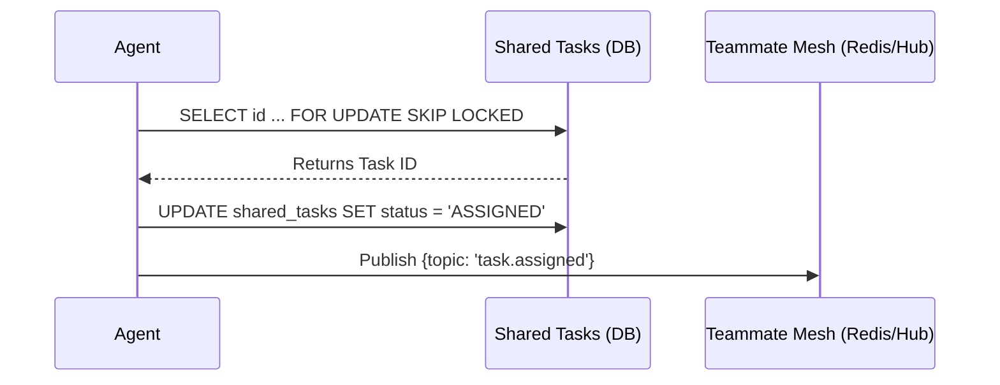

# Problem Statement
The One Human Corp (OHC) Swarm requires a central "KAIROS" orchestrator to decompose complex feature requests into a shared task list for the agent team. The platform lacks a unified Master Design defining the schema, state machines, mesh APIs, and memory consolidation pipelines required to operate effectively across both Cloud-Native (Kubernetes + Postgres/Redis) and Standalone Desktop (SQLite/Local Execution) modes. Without this foundation, autonomous agent synchronization fails, DAG dependencies stall, and long-term memory is lost.

# Research Report
1. **Hybrid Consistency**: Based on `CLAUDE_OHC.md` and codebase telemetry, the backend degrades gracefully. When operating in Standalone Mode (`OHC_STANDALONE=true`), SQLite and application-level locks are used. In Cloud Mode, PostgreSQL row locks (`FOR UPDATE SKIP LOCKED`) and distributed Redis locks are standard.
2. **KAIROS State Machine**: Transitions (`PENDING` -> `ASSIGNED` -> `IN_PROGRESS` -> `REVIEW` -> `COMPLETED`) must be tracked to survive pod failures, using explicit transactions or `rueidis` sets.
3. **Teammate Mesh**: The Realtime Teammate Mesh coordinates via Redis Pub/Sub channels (e.g., `mesh:tasks`, `mesh:coordination`) using the `CentrifugeNode` hub.
4. **AutoDream Data Pipeline**: Ephemeral memory is compressed and stored as 1536-dim vectors into `pgvector` (`autodream_memories`) in Postgres or stored as JSON blob literals (e.g., `"[0.0]"`) in SQLite.
5. **Sub-Agent Queue**: The `orchestration.TaskQueue` interface must handle delegation via ZSETs in Redis and `sub_agent_jobs` mutexed tables in SQLite.

# Design Doc
The KAIROS Engine relies on four fundamental phases of orchestration:

## Phase 1: Shared Task List (Decomposition)
A durable queue stored in the `shared_tasks` database table:
```sql
CREATE TABLE IF NOT EXISTS shared_tasks (
    id TEXT PRIMARY KEY,
    organization_id TEXT NOT NULL,
    parent_plan_id TEXT,
    title TEXT NOT NULL,
    description TEXT,
    status TEXT NOT NULL DEFAULT 'PENDING',
    agent_id TEXT,
    dependencies JSONB,
    created_at TIMESTAMPTZ DEFAULT CURRENT_TIMESTAMP,
    updated_at TIMESTAMPTZ DEFAULT CURRENT_TIMESTAMP
);
```
**Claim Flow Diagram:**


## Phase 2: Realtime Teammate Mesh APIs (Orchestration)
The Mesh runs on `CentrifugeNode` and Redis. All agents subscribe to `mesh:tasks` and `mesh:coordination`.
When state changes, `stateMachine.TransitionWithTx` publishes events.
```go
// Teammate Mesh Broadcast Payload
type MeshEvent struct {
    TaskID  string `json:"task_id"`
    Action  string `json:"action"` // CLAIM, COMPLETE, DELEGATE
    AgentID string `json:"agent_id"`
    Status  string `json:"status"`
}
```

## Phase 3: AutoDream Pipeline (Memory Consolidation)
Background workers ingest session data, use LLMs to summarize context, and embed into `autodream_memories`.
- **Cloud Mode:** `embedding vector(1536)`
- **Standalone Mode:** Uses strings `TEXT` representation for SQLite compatibility.

## Phase 4: Aesthetic Visual Layer
All generated dashboard UIs for the KAIROS Orchestrator MUST adhere to the Visual Excellence Mandate:
```html
<div markdown="1" style="backdrop-filter: blur(20px) saturate(200%); background: rgba(255, 255, 255, 0.03); font-family: 'Outfit', 'Inter', sans-serif; border: 1px solid rgba(255, 255, 255, 0.1); padding: 20px; border-radius: 12px; color: #fff;">
  <h1>KAIROS Central Hub</h1>
</div>
```

# Implementation Prompt
Dear Implementer Agent:
1. Ensure the `shared_tasks` table is instantiated correctly via `srcs/server/db/migrations`. Avoid using `IF NOT EXISTS` on column definitions.
2. In `srcs/server/orchestration/tasks_db.go` and `queue.go`, verify the `IsSQLite()` branch uses application-level locks (`sync.Mutex`) before database transactions.
3. Validate that `AutoDreamWorker` safely handles the string vector `"[0.0]"` for SQLite insertions.
4. Implement the `MeshEvent` publishing hooks in `task_orchestrator.go` over the `CentrifugeNode` instance.
5. Create comprehensive tests testing graceful degradation from PostgreSQL to SQLite. Use `context.WithValue` to mock SPIFFE/SPIRE authentication.
