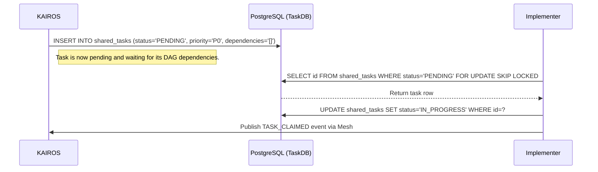

# 🗺️ Guide: [Shared Task List Schema]
## Title
Implement Shared Task List Schema
## Problem Statement
The OHC Swarm demands a highly scalable, fault-tolerant backbone to coordinate long-running distributed agentic workloads. KAIROS needs a robust distributed state machine to track asynchronous tasks (`swarm_tasks` and `shared_tasks`) across the swarm with exact sequence and DAG dependencies across both Cloud and Standalone modes.
## Research Report
Based on `KAIROS_AI_OS_ARCHITECTURE.md`, the Shared Task List is the backbone of the OHC Swarm. It tracks complex feature decomposition into actionable, sequenced `shared_tasks`. Memory dictates that the KAIROS orchestration layer uses a `dependencies` JSONB array on the `shared_tasks` table to optimize storage costs, rather than a separate relational table.
## Design Doc
### Sequence Diagram

### Database Schema (PostgreSQL)
```sql
CREATE TABLE IF NOT EXISTS shared_tasks (
    id UUID PRIMARY KEY DEFAULT gen_random_uuid(),
    organization_id VARCHAR NOT NULL,
    title VARCHAR NOT NULL,
    description TEXT,
    status VARCHAR NOT NULL DEFAULT 'PENDING',
    agent_id VARCHAR,
    priority VARCHAR NOT NULL DEFAULT 'P2',
    payload JSONB,
    dependencies JSONB DEFAULT '[]'::jsonb,
    parent_plan_id TEXT,
    locked_until TIMESTAMP WITH TIME ZONE,
    created_at TIMESTAMP WITH TIME ZONE DEFAULT CURRENT_TIMESTAMP,
    updated_at TIMESTAMP WITH TIME ZONE DEFAULT CURRENT_TIMESTAMP
);
```
## Implementation Prompt
1. Create the SQL migration file for `shared_tasks` in `srcs/server/db/migrations/`. Name it appropriately (e.g., `032_kairos_shared_tasks_schema.sql` since the last migration is 031). Note that for SQLite compatibility, we use `ALTER TABLE` without `IF NOT EXISTS` for modifications, but since this is a new table we can define it fully.
2. Implement the Go models and database repository in `srcs/server/orchestration/tasks.go` and `srcs/server/orchestration/tasks_db.go`.
3. Use `SELECT id FROM shared_tasks WHERE status='PENDING' FOR UPDATE SKIP LOCKED` for Cloud environments. For standalone mode, utilize application-level mutexes along with SQLite transaction isolation.
## Priority
P0
## Estimated Scope
Medium
