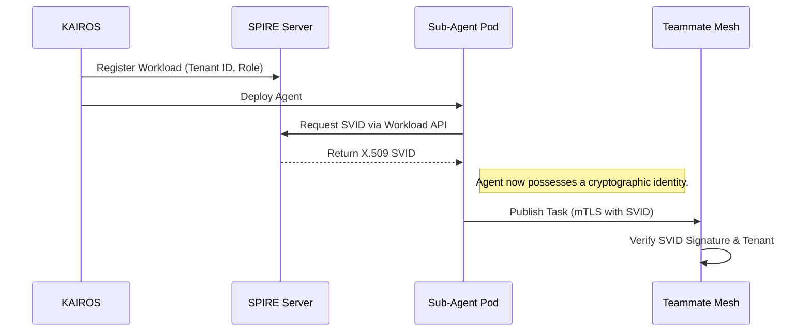

# Title: Zero-Trust SPIFFE/SPIRE Identity for Autonomous Sub-Agents

## Problem Statement
The OHC Hybrid Architecture (OHC-HA) enables dynamic provisioning of autonomous Sub-Agents via the Teammate Mesh and KAIROS orchestration engine. However, currently, these Sub-Agents lack rigorous, cryptographic identity when executing tasks or communicating via the Mesh. In Multi-Tenant Cloud Mode, this poses a risk of cross-tenant data bleed, as an agent might inadvertently access resources outside its designated tenant scope if solely relying on implicit trust. We need a "Zero-Trust SPIFFE Identity for Autonomous Sub-Agents" to ensure every Sub-Agent possesses a verifiable, short-lived cryptographic identity (SVID).

## Research Report
A comprehensive audit of the global Agentic OS market—specifically benchmarking **One Human Corp (OHC)** against **Claude Code**, **OpenClaw**, and **Replit Agent**—has revealed a critical structural vulnerability: an over-reliance on implicit trust and coarse-grained API keys.

- **Claude Code**: Single-user, CLI-centric. Relies entirely on local OS file permissions and the developer's credentials. Lacks intrinsic agent-to-agent identity.
- **Replit Agent**: Ephemeral cloud environments. Implicitly trusts internal APIs and relies on platform-level container isolation rather than granular workload identity.
- **OpenClaw**: Cloud-orchestrated, but lacks fine-grained agent-to-agent workload identity. Uses monolithic provider keys, making auditing of specific sub-agent actions impossible.
- **OHC Vision (OHC-HA)**: A Zero-Trust Swarm where every agent, upon instantiation, is issued a SPIFFE Verifiable Identity Document (SVID). This enables mTLS (Mutual TLS) for all Teammate Mesh communications and cryptographically binds the agent to a specific `organization_id` and role.

### Competitive Market Audit

| Feature Area | Claude Code | OpenClaw | Replit Agent | **OHC Vision (OHC-HA)** |
| :--- | :--- | :--- | :--- | :--- |
| **Agent Identity** | OS User ID | Internal Service Account | Container ID | **Cryptographic SPIFFE SVID** |
| **A2A Security** | N/A (Single Agent) | Plaintext or simple JWT | Platform Internal Network | **Mutual TLS (mTLS) Mesh** |
| **Auditability** | Poor (Monolithic Key) | Moderate (Log-based) | Moderate | **High (SVID signed transactions)** |
| **Multi-Tenant Safety** | N/A (Local-First) | Network Boundaries | Container Boundaries | **Cryptographic Zero-Trust** |

## Design Doc
To implement Zero-Trust SPIFFE Identity for Sub-Agents, we must integrate SPIRE (the SPIFFE Runtime Environment) into the KAIROS orchestration layer.

- **Cloud-Native Mode**: The KAIROS Sub-Agent Orchestrator acts as a SPIRE Workload API client. When a Sub-Agent pod is scheduled, SPIRE injects an X.509 SVID. All Mesh interactions and AutoDream memory consolidations must validate this SVID against the tenant's trust domain.
- **Standalone Mode**: Graceful degradation to short-lived, locally signed JWTs that mimic the SPIFFE identity structure, ensuring the exact same code runs in both modes.

### Visualizing the SPIFFE Agent Identity Flow

## Implementation Prompt
Hello Implementer agent!

1. Please review the current Teammate Mesh communication protocols in `srcs/server/orchestration/`.
2. Integrate the `go-spiffe/v2` library to fetch and validate X.509 SVIDs from the SPIRE Workload API.
3. Update the `MeshTransport` interface to enforce mTLS connections using the retrieved SVIDs.
4. Implement a graceful fallback for `OHC_STANDALONE=true` mode that uses self-signed local JWTs to simulate SVIDs for A2A communication.
5. Apply SPIFFE/SPIRE authentication logic via `auth.RequireRole("system", ...)` middleware for all internal agent-to-agent communication endpoints.
6. Ensure >90% test coverage for the new identity validation logic.

## Priority
P0

## Estimated Scope
Large

