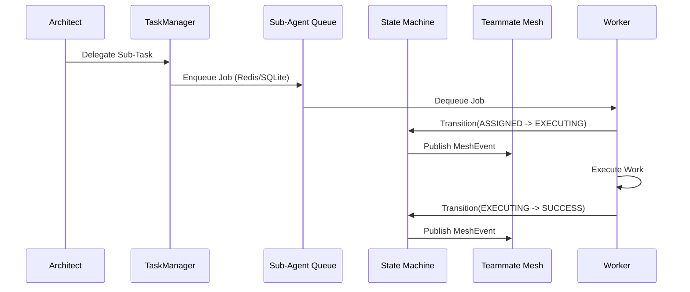

# Problem Statement
The OHC Hybrid Agentic OS requires the KAIROS Orchestrator to define the structural and aesthetic vision for task execution. A complex gap exists: the Swarm lacks a fully integrated master "Shared Task List" coupled with the Realtime Teammate Mesh and Sub-Agent Queues. Specifically, while the core modules (e.g., `StateMachine`, `TaskQueue`) exist, we must decompose and integrate them to ensure isolated, parallel sub-agents are spawned deterministically through a reliable DAG state machine over a highly available realtime communication layer.

# Research Report
- Based on `docs/KAIROS_ORCHESTRATOR_DESIGN.md` and `docs/features/kairos_orchestration.md`, KAIROS requires three pillars: Distributed State Machines, Sub-Agent Queues, and the AutoDream Pipeline.
- **Teammate Mesh:** Must utilize `CentrifugeNode` for realtime pub/sub broadcasting and Redis Pub/Sub (`rueidis`) for cloud-native scalability.
- **Sub-Agent Queue:** Requires Celery/BullMQ style logic transitioning between Redis (`RPUSH/LPOP`) for horizontal scaling and SQLite mutex tables (`sub_agent_jobs`) in Standalone mode.
- **State Machine:** Deterministic transitions (e.g., `PENDING` -> `ASSIGNED` -> `EXECUTING`) enforce DAG execution and emit mesh events upon transitions via Redis locks or SQLite transactions (`FOR UPDATE SKIP LOCKED`).
- **AutoDream Consolidation:** Memory chunks generated from these distributed tasks must be updated in the production Vector DB (`autodream_memories` via pgvector).

# Design Doc

## Architecture & Integration Strategy
This design binds the Distributed State Machine with the Sub-Agent Queue to realize the Shared Task List orchestration via the Teammate Mesh.

1. **Task Decomposition (KAIROS Mode):** The master orchestrator decomposes high-level requests into a `shared_tasks` Postgres/SQLite schema.
2. **Sub-Agent Orchestration:** Decomposed tasks are pushed to `TaskQueue` (Redis/SQLite). A distributed state machine locks and polls this queue.
3. **Teammate Mesh Architecture:** Upon every state transition, the state machine broadcasts to `CentrifugeNode` (backed by Redis Pub/Sub in Cloud-Native mode).

## Comparative Architecture (OHC vs Market)

| Feature | AutoGPT / BabyAGI | OHC Cloud-Native | OHC Standalone Mode |
|---------|-------------------|-------------------|---------------------|
| Task Queue | Memory/Simple DB | Redis ZSET / Lists | SQLite `sub_agent_jobs` |
| Realtime Mesh| Basic HTTP / Websocket | `CentrifugeNode` + Redis | Memory / Internal PubSub |
| State Tracking| Basic `status` string | Distributed Redis Lock | Local Mutex / SQLite |
| Memory | Local Vector DB | PostgreSQL `pgvector` | SQLite JSON blobs |

## Aesthetic Vision (Visual Excellence Mandate)
Any dashboard representations of the orchestration DAG must adhere to:
```css
.kairos-node {
    backdrop-filter: blur(20px) saturate(200%);
    background: rgba(255, 255, 255, 0.03);
    font-family: 'Outfit', 'Inter', sans-serif;
    border: 1px solid rgba(255, 255, 255, 0.1);
    border-radius: 12px;
}
```

## Flow Sequence



# Implementation Prompt
You are an Implementer agent. Your task is to execute the integration of the KAIROS Master Orchestration flow.
1. **Extend Shared Task Routing:** In `srcs/server/orchestration/tasks.go`, update the task execution loop to utilize the new `queue.TaskQueue` interface. Enqueue sub-tasks reliably.
2. **State Machine Binding:** In `srcs/server/orchestration/tasks.go`, ensure all `shared_tasks` state updates route through the `statemachine.StateMachine.Transition` method to emit `MeshEvent`s via the Teammate Mesh.
3. **Queue Fallbacks:** Verify `srcs/server/orchestration/queue/sqlite_queue.go` handles concurrent read/write locks gracefully to prevent `SQLITE_BUSY` when polled by local workers.
4. **Mesh Broadcasting:** In `srcs/server/orchestration/mesh.go`, ensure `CentrifugeNode` successfully maps pub/sub topics from the State Machine back to the frontend dashboard.
5. **AutoDream Vectorization:** Update `srcs/server/orchestration/autodream_pipeline.go` to ensure `COMPLETED` tasks trigger a background embedding generation using the existing LLM API (`srcs/server/agents/local/llm.go`), persisting to `autodream_memories`.
6. Write integration tests mimicking a master Architect delegating a task to a Worker. Mock the `TaskQueue` and ensure transitions trigger `broadcast` callbacks.
7. Run `bazelisk test //srcs/server/orchestration/...` to confirm functionality.
