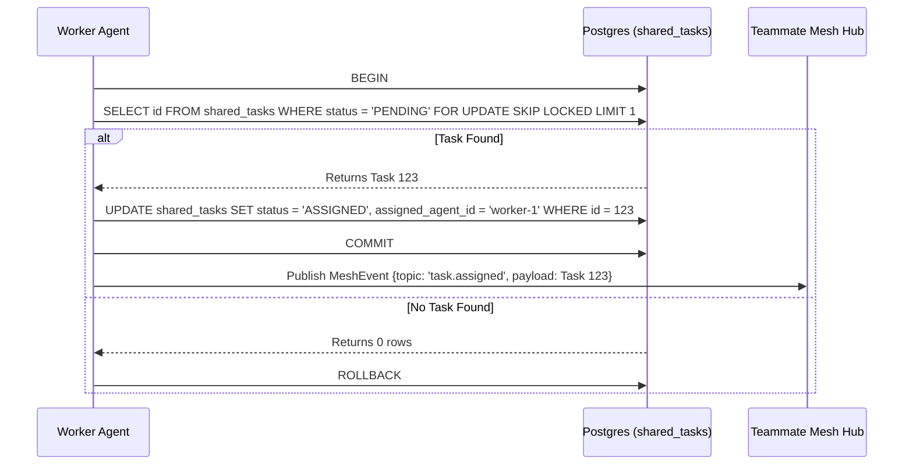

# Problem Statement
We need to orchestrate the KAIROS engine for the Swarm by decomposing feature requests. This requires designing the backend database designs and sequence diagrams for the Shared Task List (Phase 1), designing the Realtime Teammate Mesh APIs (Phase 2), architecting the AutoDream data pipelines (Phase 3), and submitting a final Master Design Doc (Phase 4).

# Research Report
Based on OHC documentation (`CLAUDE_OHC.md`, `README.md`, `docs/features/kairos/`), the Swarm orchestrator manages tasks using hybrid modes (Cloud-Native vs. Standalone). KAIROS requires three core pillars:
1. **Shared Task List:** Database schema using PostgreSQL `FOR UPDATE SKIP LOCKED` for horizontal concurrency, gracefully degrading to SQLite transactions for Standalone Mode.
2. **Teammate Mesh:** Distributed state machine utilizing Redis Pub/Sub (`rueidis`) and `CentrifugeNode` for realtime communication.
3. **AutoDream:** Long-term memory pipeline using `pgvector` to store vector embeddings of agent sessions.

# Design Doc
## Phase 1: Shared Task List (Database & Sequence Diagram)
**Database Schema (`shared_tasks`):**
```sql
CREATE TABLE IF NOT EXISTS shared_tasks (
    id TEXT PRIMARY KEY,
    organization_id TEXT NOT NULL,
    title TEXT NOT NULL,
    description TEXT,
    status TEXT NOT NULL DEFAULT 'PENDING',
    assigned_agent_id TEXT,
    priority TEXT NOT NULL DEFAULT 'P2',
    payload JSONB,
    created_at TIMESTAMPTZ DEFAULT CURRENT_TIMESTAMP,
    updated_at TIMESTAMPTZ DEFAULT CURRENT_TIMESTAMP
);
```

**Sequence Diagram (Task Claiming):**


## Phase 2: Teammate Mesh APIs
Agents require highly available Pub/Sub. The API contracts include:
- `BroadcastEvent(ctx, topic, payload)`: Emits state changes via Redis/Centrifuge.
- `Subscribe(ctx, topic)`: Listens for task delegations.

## Phase 3: AutoDream Data Pipelines
**Database Schema (`autodream_memories`):**
```sql
CREATE EXTENSION IF NOT EXISTS vector;
CREATE TABLE IF NOT EXISTS autodream_memories (
    id TEXT PRIMARY KEY,
    organization_id TEXT NOT NULL,
    agent_id TEXT,
    content TEXT NOT NULL,
    embedding vector(1536),
    source_type TEXT NOT NULL,
    created_at TIMESTAMPTZ DEFAULT CURRENT_TIMESTAMP
);
```

## Phase 4: Master Design Doc
All architecture elements must follow the **Visual Excellence Mandate**:
```css
backdrop-filter: blur(20px) saturate(200%);
background: rgba(255, 255, 255, 0.03);
font-family: 'Outfit', 'Inter', sans-serif;
```

# Implementation Prompt
You are an Implementer agent. Execute the following:
1. Implement the SQL schemas in `srcs/server/db/migrations/` and update `BUILD.bazel` appropriately.
2. Ensure database operations gracefully handle SQLite vs. PostgreSQL lock strategies.
3. Apply Visual Excellence styling to any generated UI.
