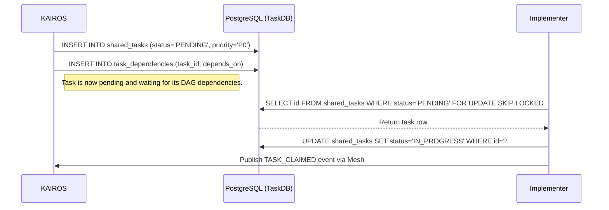

# Problem Statement
The OHC platform needs a central "KAIROS" orchestration layer. Complex architectural tasks must be decomposed into a "Shared Task List" that the agent team can process. Agents need a robust, distributed state machine and Teammate Mesh Architecture for real-time coordination and execution.

# Research Report
- Based on `README.md` and `docs/KAIROS_AI_OS_ARCHITECTURE.md`, the platform operates in a Hybrid Architecture (`OHC-HA`).
- Real-time coordination is required via WebSockets/gRPC with a Redis backplane for Cloud-Native mode.
- Durable persistence is necessary using PostgreSQL for Cloud-Native and SQLite for Standalone Desktop mode.
- We need robust locking: PostgreSQL row-level locks (`FOR UPDATE SKIP LOCKED`) and application-level locks for SQLite.
- Background queuing (Sub-Agent Queue) is required to spawn isolated sub-agents.
- AutoDream pipeline vectorizes memories to `pgvector`.
- The State Machine enforces deterministic transitions with distributed locking (Redis/PostgreSQL/SQLite).

# Design Doc
## Database Schema (`shared_tasks` & `task_dependencies`)
```sql
CREATE TABLE IF NOT EXISTS shared_tasks (
    id UUID PRIMARY KEY DEFAULT gen_random_uuid(),
    organization_id VARCHAR NOT NULL,
    title VARCHAR NOT NULL,
    description TEXT,
    status VARCHAR NOT NULL DEFAULT 'PENDING',
    agent_id VARCHAR,
    priority VARCHAR NOT NULL DEFAULT 'P2',
    payload JSONB,
    parent_plan_id TEXT,
    locked_until TIMESTAMP WITH TIME ZONE,
    created_at TIMESTAMP WITH TIME ZONE DEFAULT CURRENT_TIMESTAMP,
    updated_at TIMESTAMP WITH TIME ZONE DEFAULT CURRENT_TIMESTAMP
);

CREATE TABLE IF NOT EXISTS task_dependencies (
    task_id UUID NOT NULL REFERENCES shared_tasks(id) ON DELETE CASCADE,
    depends_on_task_id UUID NOT NULL REFERENCES shared_tasks(id) ON DELETE CASCADE,
    PRIMARY KEY (task_id, depends_on_task_id)
);
```

## State Machine Transitions
```sql
CREATE TABLE IF NOT EXISTS state_machine_transitions (
    id TEXT PRIMARY KEY,
    entity_id TEXT NOT NULL,
    entity_type TEXT NOT NULL,
    from_state TEXT NOT NULL,
    to_state TEXT NOT NULL,
    agent_id TEXT,
    reason TEXT,
    occurred_at TIMESTAMPTZ DEFAULT CURRENT_TIMESTAMP
);
CREATE INDEX IF NOT EXISTS idx_sm_entity ON state_machine_transitions(entity_id, entity_type);
```

## AutoDream Pipeline Memory Consolidation
```sql
CREATE EXTENSION IF NOT EXISTS vector;
CREATE TABLE IF NOT EXISTS autodream_memories (
    id UUID PRIMARY KEY DEFAULT gen_random_uuid(),
    topic TEXT NOT NULL,
    content TEXT NOT NULL,
    embedding vector(1536),
    created_at TIMESTAMP WITH TIME ZONE DEFAULT CURRENT_TIMESTAMP
);
```

## Teammate Mesh APIs
Realtime communication via `mesh:tasks` and `mesh:presence`.
Example Event:
```json
{
  "event_type": "TASK_CLAIMED",
  "agent_id": "Implementer-1",
  "payload": {
    "task_id": "123e4567-e89b-12d3-a456-426614174000",
    "timestamp": "2026-04-05T22:45:00Z"
  }
}
```

# Implementation Prompt
You are an Implementer agent. Your mission is to implement the KAIROS Orchestration shared task list, real-time teammate mesh APIs, state machine transitions, and autodream pipelines.

1. **Database Migrations:**
   - Create SQL migration files in `srcs/server/db/migrations/` for `shared_tasks`, `task_dependencies`, `state_machine_transitions`, and `autodream_memories`.
   - Update `embedsrcs` in `srcs/server/db/BUILD.bazel`.

2. **Data Access Layer:**
   - Implement data access logic in Go for the task and state machine models (e.g., `srcs/server/orchestration/tasks_db.go`).
   - Implement `ClaimTask` using `SELECT * FROM shared_tasks WHERE status='PENDING' FOR UPDATE SKIP LOCKED` for Postgres and application-level locks for SQLite.

3. **Teammate Mesh:**
   - Implement Pub/Sub events for the mesh APIs (Redis for Cloud-Native, local channels for Standalone).

4. **Testing:**
   - Write unit tests in Go (`bazelisk test //srcs/server/orchestration/...`).
   - Mock claims using `context.WithValue`.

5. **Visual Guidelines:**
   - Any UI created must apply the OHC Premium Feel: `backdrop-filter: blur(20px) saturate(200%)`, `background: rgba(255, 255, 255, 0.03)`, `font-family: 'Outfit', 'Inter', sans-serif`.

# Sequence Diagram (UltraPlan/Decomposition)

