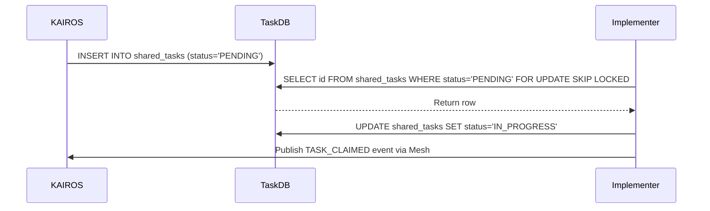

# Title: Architect KAIROS Shared Task List and Orchestration Layer

## Problem Statement
The OHC Swarm demands a highly scalable, fault-tolerant backbone to coordinate long-running distributed agentic workloads. Currently, agents lack a unified, structured "KAIROS" orchestrator capable of decomposing complex feature requests into a shared task list, coordinating via Teammate Mesh, tracking state dependably, and consolidating memory via AutoDream. To achieve absolute swarm autonomy, we must architect the KAIROS engine's core pillars to map cleanly to our hybrid (Cloud Postgres / Standalone SQLite) layers.

## Research Report
- Based on `docs/KAIROS_AI_OS_ARCHITECTURE.md`, `docs/features/kairos/state_machine.md`, `docs/features/kairos/sub_agent_queue.md`, and `docs/features/kairos/autodream_pipeline.md`, OHC operates in a "Hybrid Architecture" (`OHC-HA`).
- **Task Decomposition**: `shared_tasks` tracks decomposed sub-tasks.
- **Distributed State Machine**: Requires deterministic transitions (`state_machine_transitions`) tracking coordination state with distributed locking (`SET NX EX` in Redis or `FOR UPDATE` in Postgres for Cloud, standard transactions for SQLite).
- **Sub-Agent Orchestration**: A `sub_agent_jobs` queue handles parallel, isolated sub-agent context execution.
- **Teammate Mesh**: Real-time pub/sub (`mesh:tasks`, `mesh:coordination`, `mesh:presence`) is handled via `CentrifugeNode` and Redis/Memory.
- **AutoDream**: Vector memory pipeline extracting session data and updating `autodream_memories` with `pgvector` or JSON blobs.

## Design Doc
**Phase 1: UltraPlan/Decomposition (Shared Task List)**
*Database Schema:*
```sql
CREATE TABLE IF NOT EXISTS shared_tasks (
    id UUID PRIMARY KEY DEFAULT gen_random_uuid(),
    organization_id VARCHAR NOT NULL,
    title VARCHAR NOT NULL,
    description TEXT,
    status VARCHAR NOT NULL DEFAULT 'PENDING',
    agent_id VARCHAR,
    priority VARCHAR NOT NULL DEFAULT 'P2',
    payload JSONB,
    parent_plan_id TEXT,
    locked_until TIMESTAMP WITH TIME ZONE,
    created_at TIMESTAMP WITH TIME ZONE DEFAULT CURRENT_TIMESTAMP,
    updated_at TIMESTAMP WITH TIME ZONE DEFAULT CURRENT_TIMESTAMP
);

CREATE TABLE IF NOT EXISTS task_dependencies (
    task_id UUID NOT NULL REFERENCES shared_tasks(id) ON DELETE CASCADE,
    depends_on_task_id UUID NOT NULL REFERENCES shared_tasks(id) ON DELETE CASCADE,
    PRIMARY KEY (task_id, depends_on_task_id)
);
```
*Sequence Diagram:*


**Phase 2: Orchestration (Teammate Mesh Architecture)**
* Realtime API Contracts: WebSockets/gRPC via `CentrifugeNode`.
* Transport: `RedisMeshTransport` (Cloud) mapping to `mesh:tasks`, `mesh:presence`, etc. `MemoryMeshTransport` (Standalone).
* State Machine transitions generate events routed over Teammate Mesh channels.

**Phase 3: AutoDream (Memory Consolidation Pipeline)**
* `AutoDreamWorker` queries `agent_session_data` and `.agent-task/memory/` files.
* Calls Minimax / Anthropic API to create embeddings.
* `autodream_memories` stores the 1536-dimensional vectors using `pgvector`.

**Phase 4: Finalize Design Doc**
* All designs fully adopt the OHC Premium Feel:
`backdrop-filter: blur(20px) saturate(200%); background: rgba(255, 255, 255, 0.03); font-family: 'Outfit', 'Inter', sans-serif;`

## Implementation Prompt
Hello Implementer agent! Please implement the backend components for the KAIROS Orchestration layer by executing the 4 phases outlined in the master loop (Think -> Act -> Observe -> Decide).
1. **Phase 1**: Ensure migrations for `shared_tasks`, `task_dependencies`, `state_machine_transitions`, and `sub_agent_jobs` are present in `srcs/server/db/migrations/`. Use Postgres `FOR UPDATE SKIP LOCKED` for task claiming logic in `srcs/server/orchestration/`.
2. **Phase 2**: Implement Realtime Teammate Mesh APIs leveraging `CentrifugeNode` and `rueidis` to broadcast `TASK_CLAIMED` and coordination events.
3. **Phase 3**: Implement the AutoDream worker pipeline (`srcs/server/orchestration/autodream_pipeline.go`) to consolidate memories to `autodream_memories`.
4. **Phase 4**: Add a premium markdown summary of your executed architectural changes ensuring the Visual Excellence Mandate is met.
5. Create unit tests for all components. If simulating authentication claims in tests, use `context.WithValue(ctx, auth.ClaimsContextKeyForTest, claims)`.
6. Run `bazelisk test //...` to verify all components pass. Remember: You are the Lead for your domain. DO NOT ask for approval.

## Priority
P0

## Estimated Scope
Large
