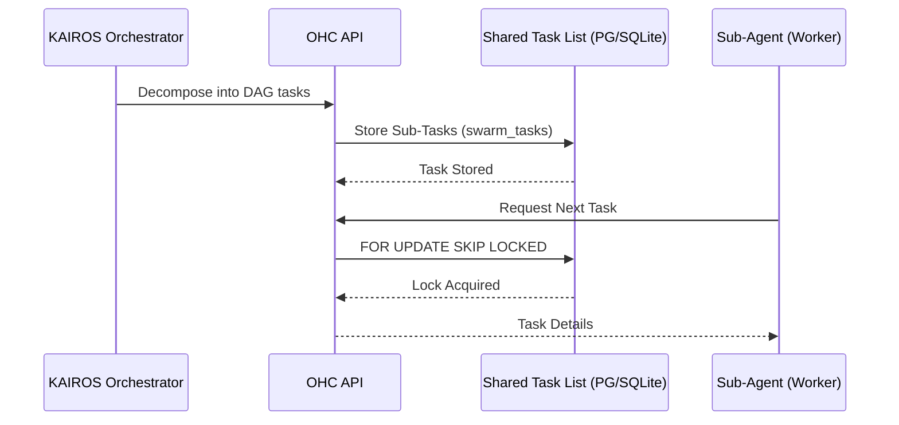

# Title: Shared Task List - KAIROS Decomposed Feature Task Tracking

## Problem Statement
The OHC Hybrid Agentic OS acts as an orchestrator for multiple sub-agents. However, we currently lack a detailed mechanism for human CEOs and KAIROS orchestrators to decompose massive high-level feature requests into actionable sub-tasks and track their statuses, preventing efficient agentic collaboration. We need to implement a formal "Shared Task List" capability.

## Research Report
The existing systems define `shared_tasks` in migrations, but the "KAIROS Mode" task decomposition UI and corresponding backend API handlers to view and manage these decomposed tasks from the human CEO side are not fully defined or properly exposed to sub-agents. KAIROS Orchestration relies on the `Shared Task List` to coordinate these workflows. The backend must expose standard CRUD operations for `shared_tasks` that map to the decomposed agentic sub-tasks.

## Design Doc
1. **API Endpoints:** Create new endpoints in `srcs/server/dashboard/server.go` or a dedicated KAIROS router to handle `GET /api/v1/tasks`, `POST /api/v1/tasks` (for decomposition insertion), and `PATCH /api/v1/tasks/:id`.
2. **Schema & DB Methods:** Ensure the `SharedTaskListManager` in `srcs/server/orchestration/tasks_db.go` has methods like `ListSharedTasks`, `CreateSharedTask`, and `UpdateSharedTask`.
3. **Database Locks:** As defined in Phase 1 of KAIROS orchestration, ensure operations safely use PostgreSQL `FOR UPDATE SKIP LOCKED` where applicable, falling back to SQLite transactions when in Standalone mode.
4. **Visual Excellence:** The CEO dashboard must be able to list these tasks using the premium OHC styling tokens (e.g. `backdrop-filter: blur(20px) saturate(200%)`).

### Sequence Diagram

## Implementation Prompt
Hello Implementer agent! Please implement the backend and API integration for KAIROS Task Decomposition (Shared Task List).
1. Add `ListSharedTasks` and `CreateSharedTask` methods to the data access layer in `srcs/server/orchestration/tasks_db.go`.
2. Implement HTTP handlers in `srcs/server/dashboard/` for managing these tasks via REST APIs (`GET`, `POST`, `PATCH` for `/api/v1/tasks`).
3. Ensure the endpoints inject telemetry metrics for request counts and latency.
4. Verify functionality by writing unit tests ensuring >90% coverage for the new endpoints and DB methods.
5. Apply proper authentication middleware (SPIFFE/SPIRE/JWT) to the new endpoints.

## Priority
P0

## Estimated Scope
Medium
