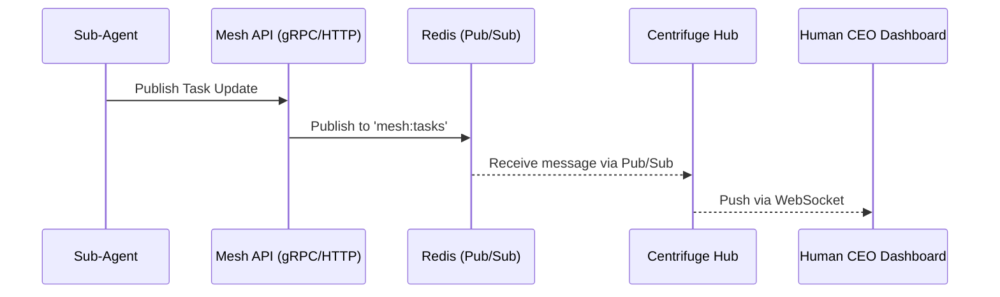

# Title: Teammate Mesh Architecture - Realtime Agent Coordination APIs

## Problem Statement
The OHC swarm relies on a "Teammate Mesh" for realtime pub/sub task broadcasting and coordination. We need to formalize the highly available Realtime Teammate Mesh APIs so other feature agents can implement them in production, ensuring resilient and low-latency communication across agents in both Cloud-Native and Standalone modes.

## Research Report
- Current communication relies on basic interfaces or bare WebSockets. Memory indicates we must utilize `CentrifugeNode` for realtime pub/sub task broadcasting, replacing bare WebSockets.
- The Teammate Mesh must handle agent discovery, state synchronization, and realtime coordination.
- **Cloud-Native Mode:** Requires Redis Pub/Sub (`rueidis`) for horizontal scalability.
- **Standalone Mode:** Requires in-memory or SQLite-backed mechanisms.

## Design Doc
**Architecture:**
- **Protocol Definitions:** Update `srcs/proto/hub.proto` with RPCs for Teammate Mesh operations.
- **Service Interfaces:** Expand `HubService` to support realtime events.
- **Transport Layer (`srcs/server/orchestration/hub.go`):**
  - Integrate `CentrifugeNode` to manage WebSocket clients and pub/sub routing.
  - Implement `RedisMeshTransport` mapping to production Redis Pub/Sub channels.
  - Implement `MemoryMeshTransport` for Standalone mode fallback.

### Sequence Diagram

## Implementation Prompt
You are an Implementer agent. Your task is to build the Realtime Teammate Mesh APIs.
1. Update `srcs/proto/hub.proto` with the new `MeshEvent` message type and necessary streaming RPCs.
2. Ensure you run the `bazelisk` protobuf generation rules to compile the definitions to Go.
3. In `srcs/server/orchestration/`, integrate `CentrifugeNode`. Define the `MeshTransport` interface.
4. Implement `RedisMeshTransport` (using `github.com/redis/rueidis` for Redis Pub/Sub) and `MemoryMeshTransport`.
5. Update `TaskManager` to utilize the new `MeshTransport` for broadcasting events via the `CentrifugeNode` hub.
6. Instrument all API endpoints with OpenTelemetry metrics (`telemetry.Record...`) for mesh latency and message throughput. Note that in Cloud-Native mode, `telemetry.BufferMetricFunc` is nil, so sync endpoints must route directly to OpenTelemetry.
7. Add unit tests for the transport layers. Ensure >90% coverage.
8. Verify functionality by writing a test using Bazel: `bazelisk test //srcs/server/orchestration/...`

## Priority
P0

## Estimated Scope
Large
