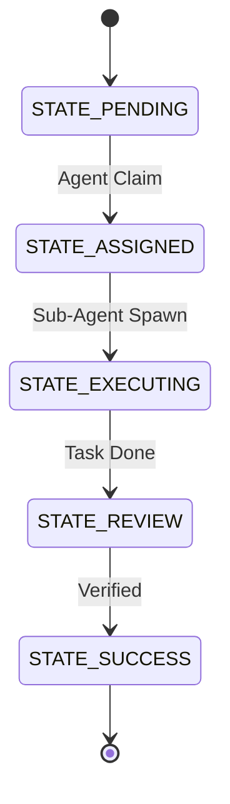

# Title: KAIROS Orchestrator: Shared Task List & Teammate Mesh Architecture

## Problem Statement
The One Human Corp (OHC) Swarm lacks a unified, distributed state tracking system to coordinate massive concurrency among sub-agents. Current implementations suffer from structural vulnerabilities, creating potential deadlocks and context-loss during multi-agent workflows. Competitor platforms force a binary choice between pure cloud dependency or strictly siloed local states. The gap is the absence of a "True Hybrid" multi-tenant and local-fallback "Shared Task List" combined with a highly available realtime communication layer (Teammate Mesh).

## Research Report
A deep architectural review of OHC-HA vs. competitors (Claude Code, OpenClaw, Replit Agent) reveals an opportunity to build a "Blue Ocean" feature: Omni-Context Sub-agent Routing integrated with a Shared Task List. Competitors rely on agents actively discovering state via ad-hoc file reads, adding latency and token bloat. OHC has a decisive opportunity to construct a database-backed KAIROS orchestrator. This orchestrator will utilize a distributed state machine (PostgreSQL/SQLite) and enqueue background sub-agents robustly. Furthermore, the generation of episodic memory must be intelligently converted to long-term vector embeddings via an "AutoDream" pipeline to enable long-term reasoning without overflowing context windows.

## Design Doc

The KAIROS Orchestrator will encompass three major phases:

### Phase 1: Shared Task List DB Schema & State Machine
The core DAG of task dependencies must enforce deterministic transitions (`PENDING` -> `ASSIGNED` -> `IN_PROGRESS` -> `COMPLETED`).
- **Cloud Mode**: PostgreSQL Multi-Tenant orchestration.
- **Standalone Mode**: SQLite fallback using transactions/mutexes.

### Phase 2: Realtime Teammate Mesh APIs
Agents require a highly available Realtime Teammate Mesh for coordination. We will architect a Pub/Sub integration layer:
- Sub-agents publish `Task Completed` events to Redis `production Pub/Sub channels`.
- The central orchestrator subscribes to events and triggers state machine transitions, avoiding polling.

### Phase 3: AutoDream Data Pipelines
To guarantee perfect architectural alignment, OHC will synchronize swarm context into vector databases.
- **Data Ingestion**: Ephemeral memory chunks are queued into the AutoDream worker daemon.
- **Cloud Vector DB**: `pgvector` index over 1536-dimensional embeddings.
- **Local Fallback**: SQLite JSON blob storage with grace degradation.

## Implementation Prompt

**Role**: Implementer Agent
**Objective**: Build the KAIROS Orchestration shared task list, teammate mesh APIs, and AutoDream pipeline components.

**Instructions**:
1. **Shared Task List Setup**: In `srcs/server/orchestration/sipdb.go`, define the generic SQL interfaces (`CreateTask`, `UpdateTaskState`, `ListPendingTasks`). Use parameter binding placeholders (`$1, $2` for PostgreSQL and `?, ?` for SQLite) dynamically depending on the dialect.
2. **Teammate Mesh APIs**: In `srcs/server/orchestration/mesh.go`, implement a Redis Pub/Sub client. Expose an interface `PublishStateChange(ctx context.Context, taskID string, newState string)`. If `redis-server` is unavailable, log a warning and degrade gracefully.
3. **AutoDream Pipeline Schema**: Create migration files in `srcs/server/db/migrations/`.
   - `001_create_state_machine.sql`: `CREATE TABLE IF NOT EXISTS state_machine_transitions (...)`. Use standard, single `ALTER TABLE ... ADD COLUMN` statements; avoid `ADD COLUMN IF NOT EXISTS` for SQLite compatibility.
   - `002_create_autodream.sql`: Create the `autodream_memories` table with a `JSON` blob column for cross-compatibility.
4. **Visual Excellence (Frontend)**: When implementing the UI components for the Shared Task List (e.g., in `srcs/app/`), you MUST apply the OHC "Premium Feel" aesthetic core. Use the following styling tokens: `backdrop-filter: blur(20px) saturate(200%)`, `background: rgba(255, 255, 255, 0.03)`, and strictly use `font-family: 'Outfit', 'Inter', sans-serif`.
5. **Testing**: Write unit tests in `srcs/server/orchestration/sipdb_test.go`. Mock the authenticated context using `context.WithValue(ctx, auth.ClaimsContextKeyForTest, claims)`. Extract tenant claims properly, verifying `claims != nil` and `claims.OrganizationID != ""`.
6. **Pre-Commit Verifications**: Run tests locally with `bazelisk test //srcs/server/... --test_output=errors`.

**Priority**: P0 (Critical)
**Estimated Scope**: Large
