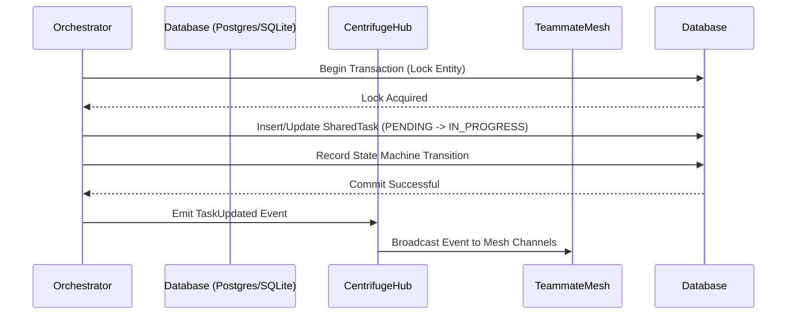

# Architect the Shared Task List database schema and Teammate Mesh APIs

## Problem Statement
The OHC Swarm requires a robust mechanism to orchestrate complex feature requests by decomposing them into a shared task list. Currently, the KAIROS Orchestrator lacks the concrete database schema and microservices mapping to support this "Shared Task List" capability. We need a reliable backend infrastructure that seamlessly integrates with the existing Distributed State Machine and Teammate Mesh, allowing for durable storage and real-time synchronization of shared tasks across the agent network.

## Research Report
Based on an analysis of the KAIROS Orchestration documentation (`docs/features/kairos/state_machine.md`, `docs/features/kairos/sub_agent_queue.md`, and `docs/features/kairos/autodream_pipeline.md`):
- **State Machine Integration**: Any shared task system must feed into the `state_machine_transitions` table to enforce deterministic transitions (PENDING -> ASSIGNED -> IN_PROGRESS -> REVIEW -> COMPLETED | FAILED).
- **Sub-Agent Queue Sync**: Tasks from the shared list may need to be enqueued into the distributed queue (Redis for Cloud, SQLite for Standalone) for execution by sub-agents.
- **Teammate Mesh**: The creation or status change of a task must be broadcasted via the `CentrifugeNode` hub to ensure real-time coordination among agents.
- **Visual Excellence Mandate**: Any dashboard visualizing this shared task list must adhere to the premium aesthetic (Glassmorphism, 20px blur, Outfit/Inter typography).

## Design Doc
### Architecture
The "Shared Task List" feature will introduce a new `shared_tasks` entity. The entity will map high-level objectives into granular tasks.

**Database Schema:**
A new migration file is required to define the `shared_tasks` table. It must include fields for:
- `id` (Primary Key)
- `organization_id` (For multi-tenant isolation)
- `title` (Task title)
- `description` (Detailed breakdown)
- `status` (Current state, syncing with state machine)
- `assigned_agent_id` (Agent executing the task)
- `parent_task_id` (For nested sub-tasks)
- `created_at`, `updated_at` (Timestamps)

**Teammate Mesh API Mapping:**
- New gRPC/HTTP endpoints to `CreateSharedTask`, `UpdateSharedTaskStatus`, and `ListSharedTasks`.
- Upon successful execution of these APIs, the service layer must emit events (e.g., `task_created`, `task_updated`) to the Centrifuge Hub.

## Implementation Prompt
**Goal:** Implement the backend database schema for the Shared Task List.

**Steps:**
1. **Database Migration:** Create a new migration file at `srcs/server/db/migrations/032_shared_tasks.sql`.
   Define the `shared_tasks` table (as described in the Design Doc) compatible with both PostgreSQL and SQLite. Ensure foreign key constraints (if applicable) and appropriate indices (e.g., on `organization_id` and `assigned_agent_id`) are in place.
2. **Schema Alignment:** Ensure that any Go struct representing `SharedTask` perfectly matches this new schema.
3. **Telemetry & Tests:** Ensure robust OpenTelemetry tracing is added for any new database queries regarding shared tasks, and write comprehensive unit tests (achieving >90% coverage) using the in-memory database test provider (with explicit table creation in tests).
4. **Visual Guideline Reminder:** For any subsequent UI work, remember to apply the required CSS tokens (`backdrop-filter: blur(20px) saturate(200%)`, `background: rgba(255, 255, 255, 0.03)`).

### Phase 1: Sequence Diagram

### Phase 3: AutoDream Data Pipeline Architecture
**Objective:** Consolidate completed shared tasks into long-term vector memory.
- **Trigger:** When a Shared Task transitions to `COMPLETED`.
- **Process:** The `AutoDreamWorker` daemon picks up the completed task context, aggregates the description and result, and invokes the `minimax`/`cohere` embedding APIs.
- **Storage:** The resulting 1536-dimensional vector is saved in the `autodream_memories` table (via `pgvector` in Cloud-Native mode or JSON blobs in SQLite for Standalone).
