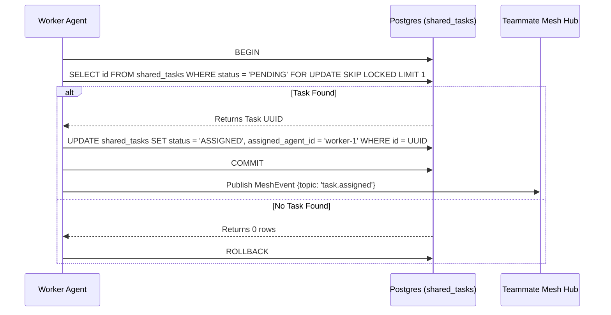

# Title: KAIROS Phase 1: Shared Task List Decomposition Design

## Problem Statement
The OHC swarm requires a centralized mechanism to decompose high-level architectural features and manage "Shared Task Lists". This system must function correctly across Cloud-Native Mode (PostgreSQL) and Standalone Desktop Mode (SQLite), requiring careful schema design to track multi-agent dependencies securely without worker collision.

## Research Report
- Based on the Hybrid Architecture mandate (OHC-HA), persistence uses PostgreSQL for multi-tenant deployments and SQLite for standalone execution.
- We require robust distributed locking mechanisms for task claims:
  - **Cloud (Postgres)**: Use row-level  to prevent concurrent assignments.
  - **Standalone (SQLite)**: Use application-level mutexes or simple transaction isolation strategies (e.g., explicit atomic updates where ).
- A shared task queue allows complex orchestration features (like Teammate Mesh or autoDream integrations) to be broken down into discrete steps.

## Design Doc
**Database Schema (`shared_tasks`):**
```sql
CREATE TABLE IF NOT EXISTS shared_tasks (
    id TEXT PRIMARY KEY,
    organization_id TEXT NOT NULL,
    parent_plan_id TEXT,
    title TEXT NOT NULL,
    description TEXT,
    status TEXT NOT NULL DEFAULT 'PENDING',
    assigned_agent_id TEXT,
    dependencies JSONB, -- Stores dependent task IDs to optimize relation counts
    created_at TIMESTAMPTZ DEFAULT CURRENT_TIMESTAMP,
    updated_at TIMESTAMPTZ DEFAULT CURRENT_TIMESTAMP
);
CREATE INDEX IF NOT EXISTS idx_shared_tasks_org_status ON shared_tasks(organization_id, status);
```

**Sequence Diagram (Shared Task Claiming):**


## Implementation Prompt
Hello Implementer agent! Your mission is to establish the backend database designs for the "Shared Task List" feature.
1. Create the SQL migration file for  in  (e.g., ).
2. Add the new  file to the  array in .
3. Create the data access layer in .
4. Implement a  method ensuring hybrid compatibility:
   - For PostgreSQL (), use .
   - For SQLite, use application-level  and standard transaction isolation.
5. Provide unit tests using  to mock authentication.
6. Verify your implementation: //srcs/server/orchestration:orchestration_test                  (cached) PASSED in 57.0s
//srcs/server/orchestration/hybrid_sync:hybrid_sync_test        (cached) PASSED in 0.1s
//srcs/server/orchestration/queue:queue_test                    (cached) PASSED in 0.1s
//srcs/server/orchestration/statemachine:statemachine_test      (cached) PASSED in 0.3s

Executed 0 out of 4 tests: 4 tests pass.
There were tests whose specified size is too big. Use the --test_verbose_timeout_warnings command line option to see which ones these are.
7. Ensure all queries handle  as JSONB efficiently.

## Visual Excellence Guidelines
Any frontend representation of the Shared Task List later created must apply:
```css
body {
  backdrop-filter: blur(20px) saturate(200%);
  background: rgba(255, 255, 255, 0.03);
  font-family: 'Outfit', 'Inter', sans-serif;
}
```
