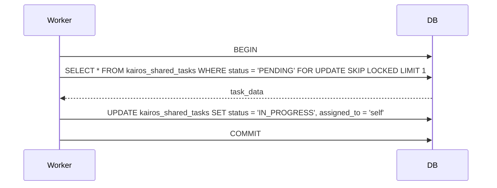

# Title: Implement KAIROS Shared Task List Schema

## Problem Statement
The OHC Hybrid Architecture needs a central KAIROS orchestrator. Currently, agents cannot share tasks across the swarm durably. We need a backend database design for the "Shared Task List" feature that degrades gracefully from PostgreSQL in Cloud mode to SQLite in Standalone Desktop mode.

## Research Report
The primary requirement is to track shared tasks and dependencies in a distributed state machine. To handle concurrent agent claims in Postgres, we require `FOR UPDATE SKIP LOCKED`. For SQLite, it degrades to standard transactions/mutexes.

## Design Doc
We need a new table `kairos_shared_tasks`:
- `id`: string primary key
- `organization_id`: string
- `title`: string
- `description`: string
- `status`: string
- `dependencies`: JSONB (postgres) / TEXT (sqlite)
- `assigned_to`: string
- `created_at`: timestamp

Sequence Diagram (Task Claiming):

## Implementation Prompt
Hello Implementer!
1. Create `srcs/server/db/migrations/033_kairos_shared_tasks.sql` containing the schema.
2. Update `embedsrcs` in `srcs/server/db/BUILD.bazel`.
3. Add a Go DB method using `FOR UPDATE SKIP LOCKED` logic conditionally on `!IsSQLite()`.

## Priority
P0

## Estimated Scope
Medium
