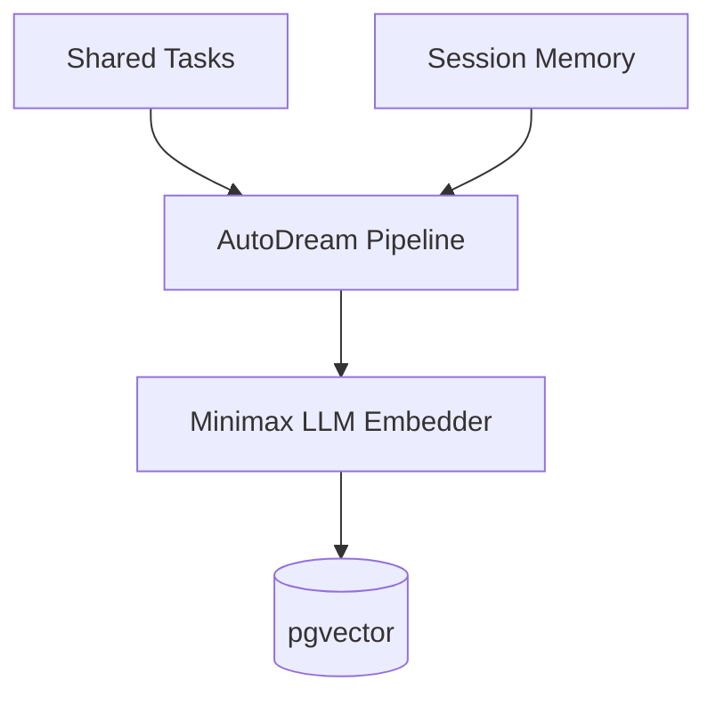

# Problem Statement
The OHC Swarm needs a long-term persistence layer to compress ephemeral session logs and intermediate artifacts via Minimax LLMs and embed them into a pgvector index.

# Research Report
PostgreSQL must use the `pgvector` extension. SQLite must degrade gracefully to text extraction/recency-based search.

# Design Doc
Create a new table `autodream_memories` with a vector column for embeddings.
Implement a background pipeline to periodically sweep completed tasks and session contexts, embed them, and store them.

# Implementation Prompt
Implement the AutoDream background pipeline. Create the `autodream_memories` schema migration. Build the data access layer for exact semantic search in PostgreSQL, and fallback logic for SQLite.

## Visual Excellence Mandate
`backdrop-filter: blur(20px) saturate(200%); background: rgba(255, 255, 255, 0.03); font-family: 'Outfit', 'Inter', sans-serif;`
