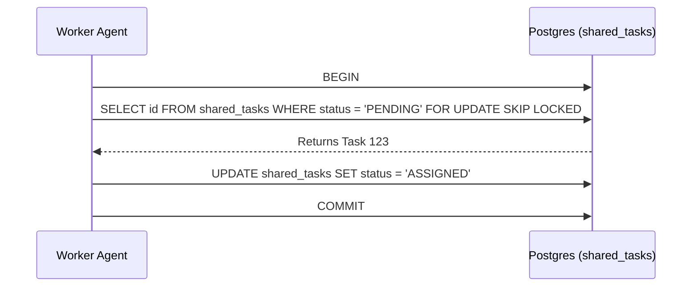

# Problem Statement
The OHC Agentic OS lacks a shared task list backend to coordinate tasks among the Swarm. We need a durable distributed state machine living in PostgreSQL with graceful degradation to SQLite.

# Research Report
Postgres must use `FOR UPDATE SKIP LOCKED` to allow horizontal pod concurrency.
SQLite must rely on application-level mutexes to prevent worker collisions.

# Design Doc
Create a new table `shared_tasks` in the database.
Fields should include `id`, `organization_id`, `parent_plan_id`, `title`, `description`, `status`, `assigned_agent_id`, `dependencies` (JSONB), and timestamps.

# Implementation Prompt
Implement the database schema migrations for `shared_tasks` in both PostgreSQL and SQLite. Implement the data access layer to acquire and complete tasks using the required locking mechanisms. Ensure the backend degrades gracefully to Standalone Mode.

## Visual Excellence Mandate
`backdrop-filter: blur(20px) saturate(200%); background: rgba(255, 255, 255, 0.03); font-family: 'Outfit', 'Inter', sans-serif;`
