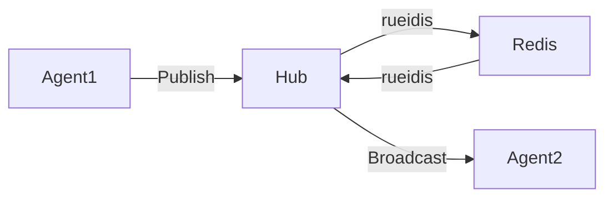

# Problem Statement
The OHC Swarm needs a highly available, low-latency communication layer to coordinate and stream events.

# Research Report
We must use `CentrifugeNode` and Redis Pub/Sub (`rueidis`) for cloud-native deployment. Standalone mode must degrade gracefully to in-memory/SQLite pub/sub.

# Design Doc
Implement the `MeshEvent` protobuf definition.
Implement `RedisMeshTransport` and `MemoryMeshTransport` satisfying a `MeshTransport` interface.

# Implementation Prompt
Implement the Teammate Mesh APIs utilizing `CentrifugeNode` and `rueidis`. Integrate it into the orchestration layer so agents can broadcast state changes and advertise capabilities.

## Visual Excellence Mandate
`backdrop-filter: blur(20px) saturate(200%); background: rgba(255, 255, 255, 0.03); font-family: 'Outfit', 'Inter', sans-serif;`
