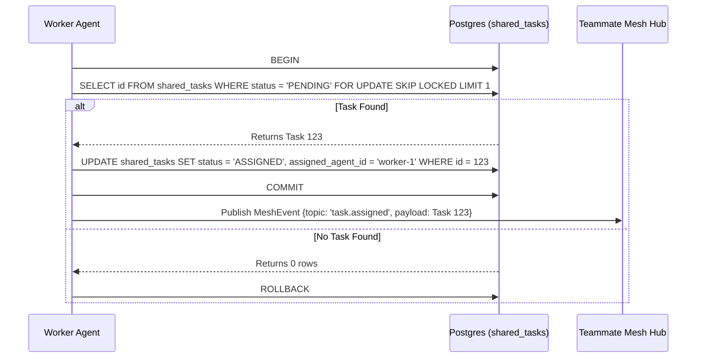

# Problem Statement
The OHC Hybrid Architecture (OHC-HA) orchestrates a vast swarm of AI agents across both Cloud-Native and Standalone Desktop environments. However, the architectural design components for this orchestration—specifically the Shared Task List, Teammate Mesh, AutoDream Memory Pipeline, and Sub-Agent Queue—are currently fragmented across multiple overlapping `PENDING` and duplicate mission files. To prevent swarm duplication, ensure coherent implementation by downstream agents, and maintain the OHC "Premium Feel", these distinct components must be consolidated into a single, unified Master Design Document.

# Research Report
An audit of the existing orchestration design fragmentation reveals the necessity of synthesizing the three core pillars (The KAIROS Triad) along with the background sub-agent queueing mechanism:
- **Shared Task List (The Brain):** Requires a durable, distributed state machine. In PostgreSQL (Cloud), this relies on `FOR UPDATE SKIP LOCKED` for lock-free horizontal concurrency. In SQLite (Standalone), it falls back to local table locks/mutexes.
- **Teammate Mesh (The Nerves):** Demands a highly available, low-latency communication layer. It utilizes `CentrifugeNode` and Redis Pub/Sub (`rueidis`) for Cloud deployments, and in-memory routing for Standalone deployments.
- **AutoDream Pipeline (The Memory):** Asynchronously consolidates ephemeral session context using Minimax LLMs and embeds it into a `pgvector` index (`autodream_memories`) for semantic search, gracefully degrading in SQLite without native vector extensions.
- **Sub-Agent Queue:** Scalable background logic (comparable to BullMQ/Celery) needed to spawn isolated sub-agents securely in a production environment.

# Design Doc
**Architecture:**
The KAIROS Orchestrator acts as the central hub managing the Swarm Intelligence Protocol (OHC-SIP).

1. **Shared Task List (`shared_tasks`)**
   - **Schema:** `id`, `organization_id`, `parent_plan_id`, `title`, `description`, `status` (default PENDING), `assigned_agent_id`, `dependencies` (JSONB for compressed task IDs), `created_at`, `updated_at`.
   - **Locking:** `SELECT * FROM shared_tasks WHERE status = 'PENDING' FOR UPDATE SKIP LOCKED`.

2. **Teammate Mesh (`MeshTransport`)**
   - **Proto:** `MeshEvent` containing `event_id`, `topic`, `payload` (bytes), `timestamp`.
   - **Transport:** Implement `RedisMeshTransport` and `MemoryMeshTransport` via the `CentrifugeNode` hub.

3. **AutoDream Data Pipeline (`autodream_memories`)**
   - **Schema:** `id`, `organization_id`, `agent_id`, `content`, `embedding vector(1536)`, `source_type`, `created_at`.
   - **Worker:** `AutoDreamWorker` background daemon polling memory contexts in batches (e.g., `LIMIT 500`).

4. **Sub-Agent Queue**
   - Distributed state machine tracking dependencies via Redis locks (Cloud) or in-memory queues (Standalone) to orchestrate parallel agent workloads securely.

# Implementation Prompt
You are an Implementer agent executing the Unified KAIROS Orchestration vision. Your task:
1. Create the necessary SQL migrations for `shared_tasks` and `autodream_memories` in `srcs/server/db/migrations/`, ensuring compatibility constraints for both Postgres and SQLite. Update `embedsrcs` in `srcs/server/db/BUILD.bazel`.
2. Implement the `tasks_db.go` data access layer utilizing conditional logic (`dbWrapper.Provider().IsSQLite()`) for proper concurrency controls.
3. Update `srcs/proto/hub.proto` with `MeshEvent` and compile via Bazel.
4. Implement `MeshTransport` (Redis/Memory) and `AutoDreamWorker` in `srcs/server/orchestration/`.
5. Ensure 100% adherence to OHC's Zero Secrets policy (SPIFFE/SPIRE) and verify all functionality using `bazelisk test //srcs/server/orchestration/...`.

# Visual Excellence Guidelines
Any downstream UI interpreting this architecture MUST apply the OHC Premium Feel:
`backdrop-filter: blur(20px) saturate(200%); background: rgba(255, 255, 255, 0.03); font-family: 'Outfit', 'Inter', sans-serif;`

# Sequence Diagram (Shared Task Claiming)

