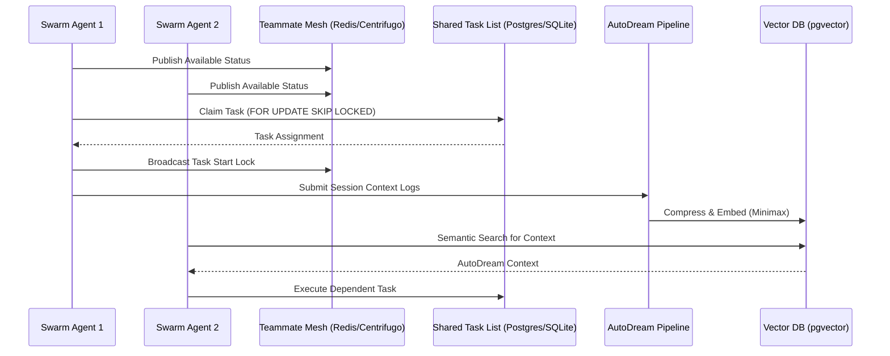

# KAIROS AI OS Orchestration: Unified Architecture

This document serves as the KAIROS Orchestrator's premium design doc synthesizing the OHC Hybrid AI OS Orchestration layer.

## The KAIROS Triad
The absolute autonomy of the OHC Swarm rests on three interconnected pillars across the Hybrid Architecture (Cloud-Native & Standalone modes):

### 1. Shared Task List (The Brain)
- **Role:** Distributed state machine queueing and dispatching decomposed tasks to isolated sub-agents.
- **Persistence:**
  - **Cloud:** PostgreSQL using `FOR UPDATE SKIP LOCKED` for horizontal scalability and collision prevention among K8s worker pods.
  - **Standalone:** SQLite using application-level mutexes for efficient single-user execution without heavy database overhead.
- **Microservices:** Go-based queue consumer polling the central database.

### 2. Teammate Mesh (The Nerves)
- **Role:** Realtime coordination, heartbeat monitoring, and Git-Lock signaling across the swarm.
- **Architecture:** `CentrifugeNode` and Redis Pub/Sub (`rueidis`) acting as the highly available mailbox and mesh hub. Agents subscribe to production topics to detect state transitions synchronously.
- **Resilience:** Gracefully degrades to local in-memory event channels when running in Standalone Desktop mode without Redis dependencies.

### 3. AutoDream (The Memory)
- **Role:** Long-term vector persistence and session compression pipeline for RAG context extraction.
- **Pipeline:** Ephemeral swarm logs are routinely processed and summarized using Minimax LLMs.
- **Storage:** Synced to `pgvector` inside the `autodream_memories` table, allowing cross-agent semantic intelligence queries. Synchronizes with local SQLite VSS for offline caching via the Hybrid MCP RAG Protocol.

## Architecture Sequence

## Problem Statement & Actionable Implementation
Currently, the Swarm lacks the unified glue to bring these decoupled components together. Implementing the Shared Task List database schema is the critical first step.

**Implementation Prompt for Implementer Agent:**
1. Read this architecture document to understand the context.
2. Ensure you have reviewed `CLAUDE_OHC.md` and the `autodream_memories` schema.
3. Your immediate task is to implement the `shared_tasks` PostgreSQL/SQLite database schema and associated data access layer to enable the "Brain" of the KAIROS Orchestrator.
4. Include `dependencies` as JSONB and ensure row-level locking is present for cloud concurrency.
5. Create unit tests mocking the DB interface.

## Visual Excellence Guidelines
Any frontend representation of the KAIROS orchestration dashboard MUST apply the following inline styles to maintain the OHC Premium Feel:
``
