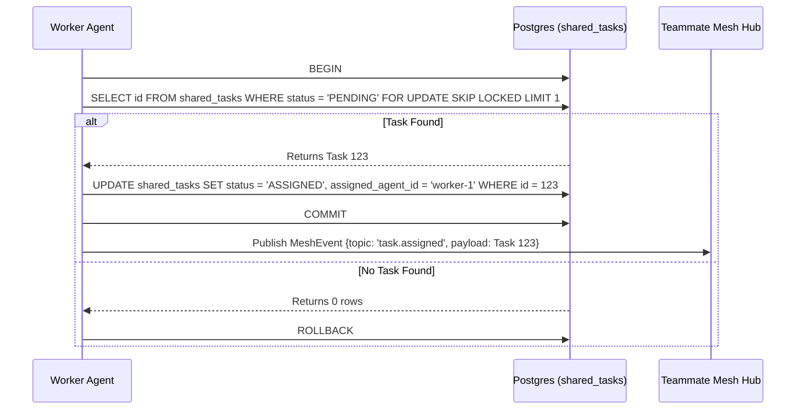

# Title: KAIROS Shared Task List & Orchestration

## Problem Statement
The OHC platform lacks a central "KAIROS" orchestration layer. We need a distributed task dependency system (DAG) that scales in the cloud but gracefully degrades locally.

## Research Report
- Based on `CLAUDE_OHC.md` and `README.md`, OHC operates in a "Hybrid Architecture" (`OHC-HA`).
- PostgreSQL's `FOR UPDATE SKIP LOCKED` handles high concurrency for Cloud-Native mode.
- SQLite requires fallback locking logic (application-level) since it does not support skip locked for Standalone Desktop Mode.

## Design Doc
**Database Schema (`shared_tasks`):**
```sql
CREATE TABLE IF NOT EXISTS shared_tasks (
    id TEXT PRIMARY KEY,
    organization_id TEXT NOT NULL,
    parent_plan_id TEXT,
    title TEXT NOT NULL,
    description TEXT,
    status TEXT NOT NULL DEFAULT 'PENDING',
    assigned_agent_id TEXT,
    dependencies JSONB,
    created_at TIMESTAMPTZ DEFAULT CURRENT_TIMESTAMP,
    updated_at TIMESTAMPTZ DEFAULT CURRENT_TIMESTAMP
);
CREATE INDEX IF NOT EXISTS idx_shared_tasks_org_status ON shared_tasks(organization_id, status);
```
**Sequence Diagram (Shared Task Claiming)**


## Implementation Prompt
Hello Implementer agent! Please write the backend logic integrating `shared_tasks` using the schema defined in the design doc.
1. Create the SQL migration file for `shared_tasks` in `srcs/server/db/migrations/`. Name it appropriately.
2. Add the migration to `embedsrcs` in `srcs/server/db/BUILD.bazel`.
3. Create the data access layer in `srcs/server/orchestration/tasks_db.go`.
4. Implement a `ClaimTask` method ensuring isolation (`FOR UPDATE SKIP LOCKED` for Postgres, app-mutex for SQLite).
5. Ensure tests achieve >90% coverage.

## Priority
P0

## Estimated Scope
Large
