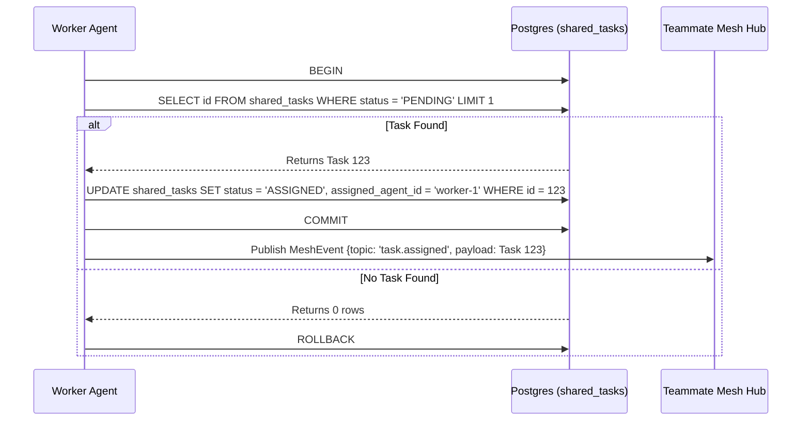

# Problem Statement
The One Human Corp (OHC) platform lacks a central "KAIROS" orchestration layer with a shared task list. To decompose complex feature requests for the Swarm, agents need a durable database schema to track the Shared Task List.

# Research Report
- Based on `CLAUDE_OHC.md` and `README.md`, OHC operates in a "Hybrid Architecture" (`OHC-HA`).
- The `shared_tasks` table is critical for representing a global queue of decomposed features.
- We need robust locking and unified database-agnostic SQL statements whenever possible to ensure execution parity across Cloud and Standalone modes.

# Design Doc
**Database Schema (`shared_tasks`):**
```sql
CREATE TABLE IF NOT EXISTS shared_tasks (
    id TEXT PRIMARY KEY,
    organization_id TEXT NOT NULL,
    parent_plan_id TEXT,
    title TEXT NOT NULL,
    description TEXT,
    status TEXT NOT NULL DEFAULT 'PENDING',
    assigned_agent_id TEXT,
    dependencies JSONB, -- Stores the compressed array of dependent task IDs
    created_at TIMESTAMPTZ DEFAULT CURRENT_TIMESTAMP,
    updated_at TIMESTAMPTZ DEFAULT CURRENT_TIMESTAMP
);
CREATE INDEX IF NOT EXISTS idx_shared_tasks_org_status ON shared_tasks(organization_id, status);
```

# Implementation Prompt
You are an Implementer agent. Your mission is to implement the backend database designs for the "Shared Task List" feature.
1. Create the SQL migration file for `shared_tasks` in `srcs/server/db/migrations/`. Name it dynamically by finding the next migration ID.
2. Add the migration to `embedsrcs` in `srcs/server/db/BUILD.bazel`.
3. Create the data access layer in `srcs/server/orchestration/tasks_db.go`.
4. Implement a `ClaimTask` method. Strive for unified, database-agnostic SQL statements to ensure execution parity and ML-Resilience. If referencing the DB provider, access the `Provider` property directly (e.g. `dbWrapper.Provider`), not as a method call.
5. Create unit tests for `tasks_db.go`. If simulating authentication claims in tests, use `context.WithValue(ctx, auth.ClaimsContextKeyForTest, claims)`.
6. Use `bazelisk test //...` to verify your code.

# Sequence Diagram

