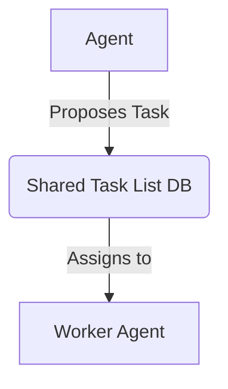

# Phase 1: Shared Task List Database Schema (PostgreSQL/SQLite)

## Problem Statement
The OHC Swarm requires a centralized, database-agnostic "Shared Task List" to distribute workloads among agents, track dependencies, and manage multi-tenant (Cloud-Native Mode) and single-user (Standalone Mode) task queuing.

## Research Report
### Competitive Analysis
| Feature | Legacy System | OHC-HA |
| --- | --- | --- |
| Execution | Sequential | Asynchronous Swarm |
| Scale | Local only | Hybrid (K8s + Desktop) |

### Mermaid Architecture

## Design Doc
- **Module Paths**: `srcs/server/db/migrations/`
- **Schema**: Add `tasks` table with `id`, `title`, `status`, `agent_id`, `priority`, `tenant_id` (for Postgres isolation).

## Implementation Prompt
Implement a unified SQL schema and Go wrapper logic for the Shared Task List. Ensure that the database migrations support both SQLite and PostgreSQL. Do not use database-specific branching in SQL.
- Create migration in `srcs/server/db/migrations/`.
- Run tests.
- Maintain test coverage > 90%.

