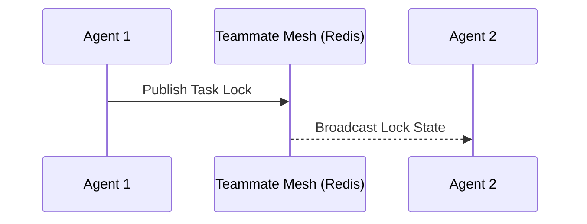

# Phase 2: Teammate Mesh Architecture (Redis Pub/Sub & WebSockets)

## Problem Statement
Agents within the OHC Swarm need to coordinate efficiently. Relying solely on database polling creates unacceptable latency and load. A highly available realtime communication layer is needed.

## Research Report
### Technology Selection
| Component | Cloud-Native Mode | Standalone Desktop Mode |
| --- | --- | --- |
| Pub/Sub | Redis Pub/Sub | In-memory Go Channels |
| Client Comm | WebSockets | WebSockets / Inter-process |

### Mermaid Diagram

## Design Doc
- **Module Path**: `srcs/server/mesh`
- **Architecture**: Create an abstraction interface that maps to Redis in Cloud mode and memory in Standalone mode. Use Go channels for event distribution.

## Implementation Prompt
Implement the Realtime Teammate Mesh APIs using Go. Define an interface. Implement the Redis Pub/Sub backend for multi-tenant deployments and a graceful degraded fallback. Include tests.

