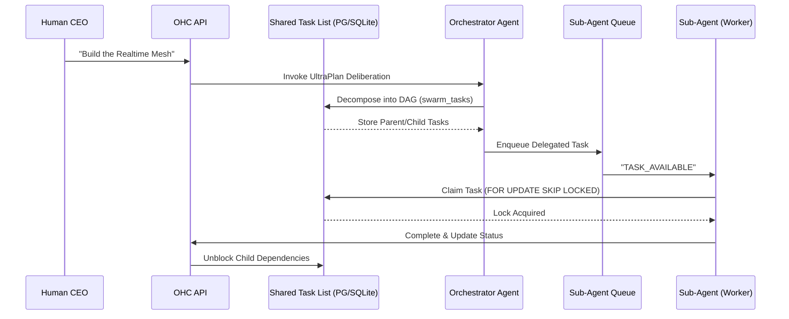

# Problem Statement
The OHC Hybrid Agentic OS requires an autonomous, resilient backbone to seamlessly decompose massive human goals into isolated, parallel agentic workflows. To prevent agents from stepping on each other and to manage complex, multi-agent DAG flows, we need a robust distributed state machine backed by the database.

# Research Report
The core tables tracking sub-agent orchestration ensure that when the Human CEO tasks the Swarm with "Build Feature X", KAIROS can safely decompose this into a hierarchical DAG.
*   **Cloud Mode**: Native `FOR UPDATE SKIP LOCKED` guarantees absolute race-condition immunity for horizontally scaled K8s pods. We use Redis Distributed Locks (`SET NX EX`) for non-transactional orchestration barriers to enforce deterministic state transitions (`PENDING` -> `EXECUTING` -> `REVIEW` -> `COMPLETED`).
*   **Standalone Mode**: Gracefully degrades to SQLite local transaction locks or application-level `sync.Mutex` (`if to.redisClient == nil { to.mu.Lock() }`). Code employs `if pool.IsSQLite()` to avoid SQL parsing panics on PG-specific syntax.

# Design Doc
## Backend Database Designs

**`swarm_tasks` and `state_machine_transitions` schema:**
```sql
CREATE TABLE IF NOT EXISTS swarm_tasks (
    id UUID PRIMARY KEY DEFAULT gen_random_uuid(),
    mission_id TEXT NOT NULL,
    parent_plan_id TEXT, -- Facilitates Sub-Agent Orchestration
    dependencies JSONB NOT NULL DEFAULT '[]', -- DAG Sequence enforcement
    title TEXT NOT NULL,
    status TEXT NOT NULL DEFAULT 'PENDING',
    assigned_agent_id TEXT,
    payload JSONB,
    locked_until TIMESTAMPTZ,
    created_at TIMESTAMPTZ DEFAULT CURRENT_TIMESTAMP
);

CREATE TABLE IF NOT EXISTS state_machine_transitions (
    id TEXT PRIMARY KEY,
    entity_id TEXT NOT NULL,
    entity_type TEXT NOT NULL,
    from_state TEXT NOT NULL,
    to_state TEXT NOT NULL,
    agent_id TEXT,
    reason TEXT,
    occurred_at TIMESTAMPTZ DEFAULT CURRENT_TIMESTAMP
);
CREATE INDEX idx_sm_entity ON state_machine_transitions(entity_id, entity_type);
```

## Sequence Diagram: UltraPlan Deliberation & State Tracking


# Implementation Prompt
Implement the Shared Task List tables (`swarm_tasks`, `state_machine_transitions`) and DAG logic. Handle distributed state machine tracking per cloud vs standalone modes (using `FOR UPDATE SKIP LOCKED` and Redis locks vs SQLite transaction locks/Mutex). Ensure all changes degrade gracefully in Standalone Mode.
