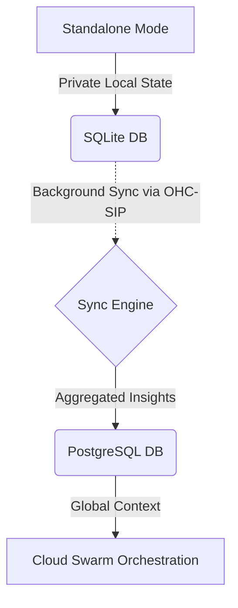

# Title: Integrate Hybrid AutoDream Synchronization

## Problem Statement
The OHC Hybrid Architecture requires seamless operations across Cloud (distributed) and Standalone (local) modes. Currently, AutoDream consolidates session memory into `autodream_memories`, but this data lives entirely locally in the SQLite database during Standalone execution, with no scalable mechanism to sync insights up to the multitenant Postgres cluster.

## Research Report
- **Market Context**: OHC requires robust synchronization of local intelligence (embedded vectors and context summaries) up to the cloud to achieve "Infinite Scaling" while retaining local privacy.
- **OHC Requirement**: We need a "Sync Daemon" that runs alongside the backend in Standalone Mode, observing `autodream_memories` for unsynced records, and pushing them to the Cloud API via mTLS.

### Comparative Analysis Table

| Feature Area | Claude Code | OpenClaw | Replit Agent | **OHC Vision (OHC-HA)** |
| :--- | :--- | :--- | :--- | :--- |
| **Privacy** | Local Only | Cloud Exfiltration | Cloud Exfiltration | **Hybrid (Local Default)** |
| **Scalability** | CPU Bound | Infinite | Infinite | **Dynamic Escalation** |
| **Swarm Memory** | Ephemeral | Persistent (Cloud) | Persistent (Cloud) | **Persistent (Sync Local ↔ Cloud)** |

### Architecture Flow

## Design Doc
- **Database Architecture**: Introduce a `sync_status` (`VARCHAR(50) DEFAULT 'pending'`) and `last_sync_at` (`TIMESTAMP NULL`) to `autodream_memories`.
- **Backend Architecture**: Implement a Go interface `hub.AutoDreamSyncService` in `srcs/server/hub/autodream_sync.go` for managing sync state.
- **Data Flow**: Standalone agents write to `autodream_memories`. A background worker fetches records where `sync_status = 'pending'` and orchestrates API calls to the Cloud layer.

## Implementation Prompt
Hello Implementer agent!
1. Create a migration file in `srcs/server/db/migrations/` (e.g., `032_autodream_sync.sql`) adding `sync_status` and `last_sync_at` to `autodream_memories`. Ensure the file is added to `embedsrcs` in `srcs/server/db/BUILD.bazel`.
2. Define the `hub.AutoDreamSyncService` interface in `srcs/server/hub/autodream_sync.go` with methods to fetch pending syncs, process incoming syncs, and mark records as synced. Define `AutoDreamSyncRecord` struct.
3. Add OpenTelemetry metrics `autodream_records_synced_total` and `autodream_sync_errors_total` to `srcs/server/telemetry/telemetry.go`.
4. Achieve >90% test coverage with unit tests in `srcs/server/hub/autodream_sync_test.go`.

## Priority
P0

## Estimated Scope
Medium

