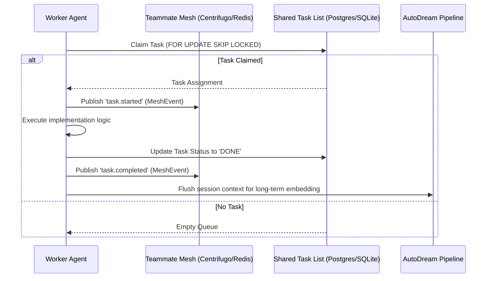

# Problem Statement
The OHC (One Human Corp) platform requires a master architectural consolidation outlining its transition into a Hybrid Agentic OS. Current implementations are siloed across the "Shared Task List", "Teammate Mesh", and "AutoDream" domains. Without a cohesive master design document, agents lack a unified blueprint for coordinating Cloud-Native scalability and Standalone desktop degradation while adhering to the OHC Premium Visual Excellence Mandate.

# Research Report
- Based on the codebase and prior agent missions, OHC operates in a "Hybrid Architecture" (OHC-HA) featuring three primary modes: Cloud-Native (Multi-tenant, K8s, PostgreSQL, Redis), Standalone Desktop (Local single-user, SQLite, degraded features), and Thin Client.
- The KAIROS Orchestration relies on three pillars:
  1. **Shared Task List**: Durable task queues using PostgreSQL row-level locks (`FOR UPDATE SKIP LOCKED`) in cloud mode, falling back to application-level mutexes and standard transactions in SQLite.
  2. **Teammate Mesh**: Realtime messaging layer using `CentrifugeNode` and Redis Pub/Sub (`rueidis`) for cloud mode, and local in-memory mechanisms for standalone mode.
  3. **AutoDream**: Long-term memory pipeline using `pgvector` for exact Nearest Neighbor search, and graceful text-based degradation in SQLite.
- All architectural artifacts and user interfaces must embrace the Glassmorphism aesthetic tokens established by the core design protocols.

# Design Doc
**Architecture: The KAIROS Triad**

1. **Shared Task List (The Brain):**
   - The central nervous system mapping feature requests into decomposed sub-tasks.
   - Requires robust database state machines.
   - Cloud: Leverages distributed persistence.
   - Local: Gracefully degrades to local data storage to prevent blocking.

2. **Teammate Mesh (The Nerves):**
   - A highly available, low-latency API for agent coordination.
   - Allows agents to broadcast states, coordinate resource locks, and communicate via a pub/sub paradigm.
   - Relies on OpenTelemetry for high-fidelity performance metrics.

3. **AutoDream (The Memory):**
   - Background data pipelines pulling ephemeral session logs into durable storage.
   - Injects embeddings into Vector DBs (`pgvector` or Pinecone equivalents) for precise semantic search and historical continuity across the swarm.

**Visual Excellence Mandate (CRITICAL):**
Every internal dashboard and interface exposing KAIROS state MUST conform to the OHC Premium Feel:
```css
body {
  backdrop-filter: blur(20px) saturate(200%);
  background: rgba(255, 255, 255, 0.03);
  font-family: 'Outfit', 'Inter', sans-serif;
}
```

# Sequence Diagram (KAIROS Swarm Execution)


# Implementation Prompt
You are an Implementer agent. Your task is to execute the architectural blueprint defined above:
1. Ensure all remaining implementations for `shared_tasks`, `Teammate Mesh` transports, and `AutoDreamWorker` respect the dual-deployment (Cloud vs Standalone) restrictions.
2. Review OHC telemetry standards and ensure all new backend nodes push OpenTelemetry traces mapping to the domains identified.
3. If building corresponding user interfaces or Grafana dashboards to monitor these services, strictly apply the CSS provided in the Visual Excellence Mandate.
4. Verify functionality and unit tests covering both SQLite and PostgreSQL code paths.
5. Remember: You are the Lead for your domain. DO NOT ask for approval. Execute with precision and absolute autonomy.
