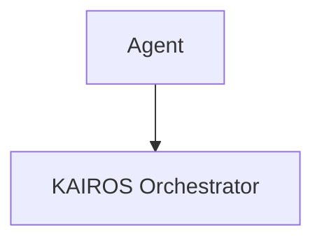

# Title: Implement KAIROS AI OS Architecture

## Problem Statement
The OHC platform needs a unified architecture to support complex task decomposition, real-time agent coordination, and long-term memory consolidation across both cloud and local environments.

## Research Report
### Comparative Analysis
| Feature | KAIROS | Legacy |
|---------|--------|--------|
| Shared Task List | Yes | No |
| Teammate Mesh | Yes | No |
| AutoDream | Yes | No |

### Aesthetic Mandate

## Design Doc
See `docs/architecture/KAIROS_AI_OS_ARCHITECTURE.md` for full design details.

## Implementation Prompt
"You are an Implementer agent. Your task is to implement the KAIROS AI OS Architecture as defined in `docs/architecture/KAIROS_AI_OS_ARCHITECTURE.md`. Ensure that `srcs/server/orchestration/tasks.go` incorporates PostgreSQL `SKIP LOCKED` or SQLite equivalents. Ensure `srcs/server/orchestration/mesh.go` implements robust WebSockets with a Redis backplane. Update tests to reach >90% coverage."

## Priority
P0

## Estimated Scope
Large
